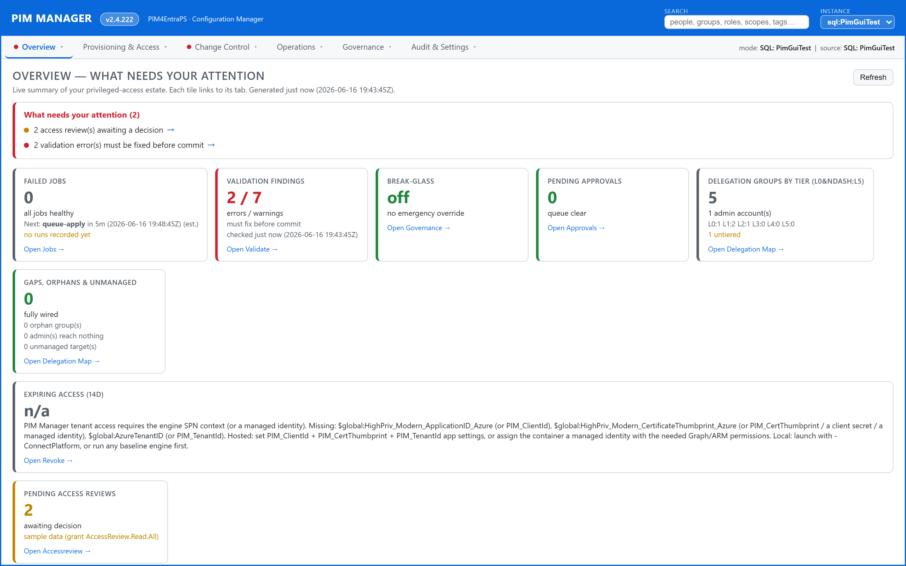
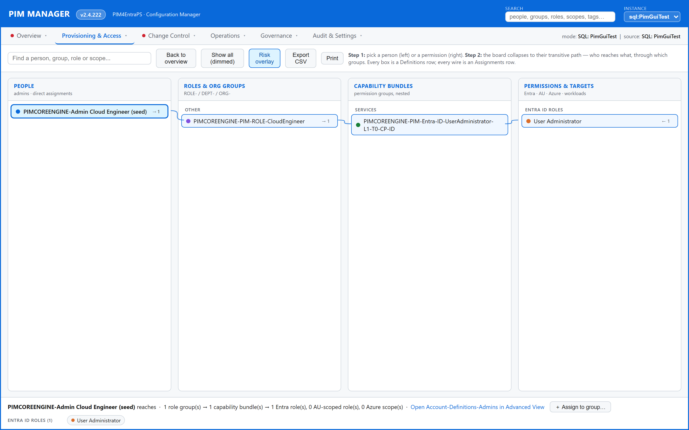
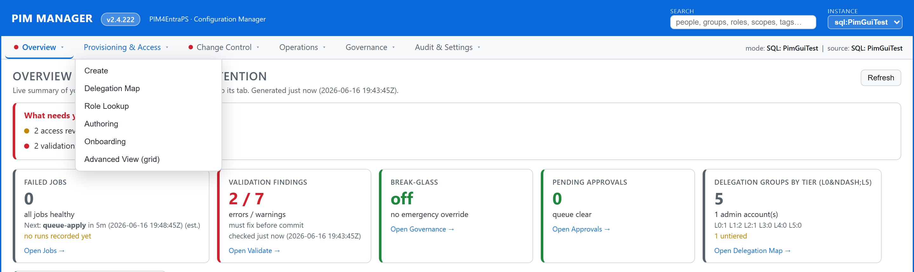
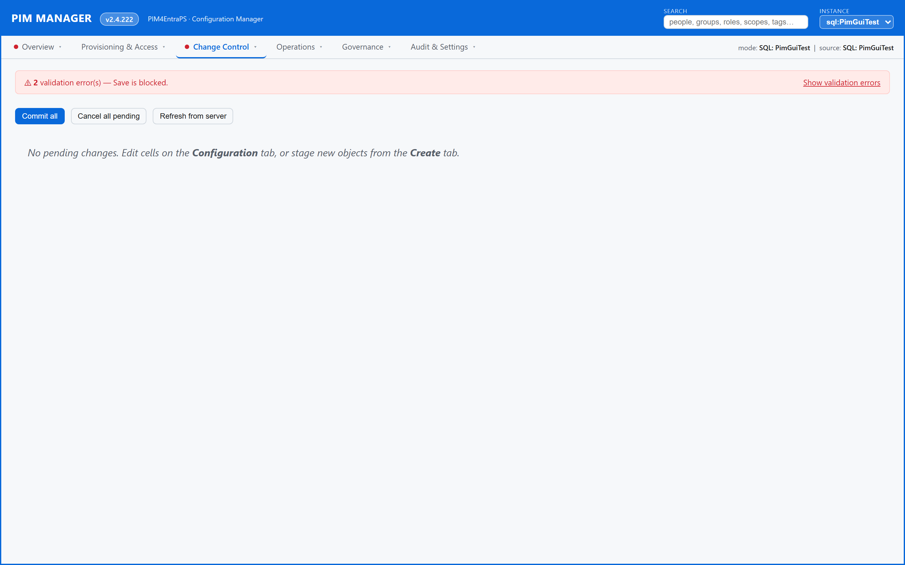
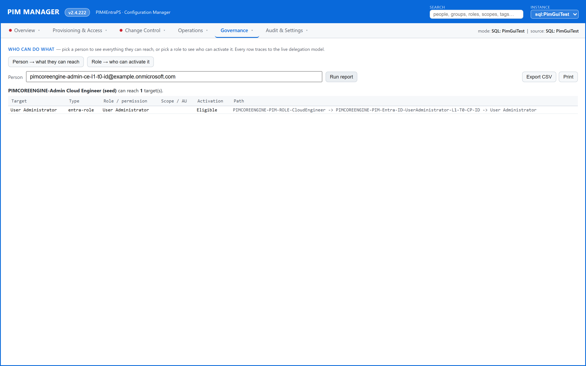
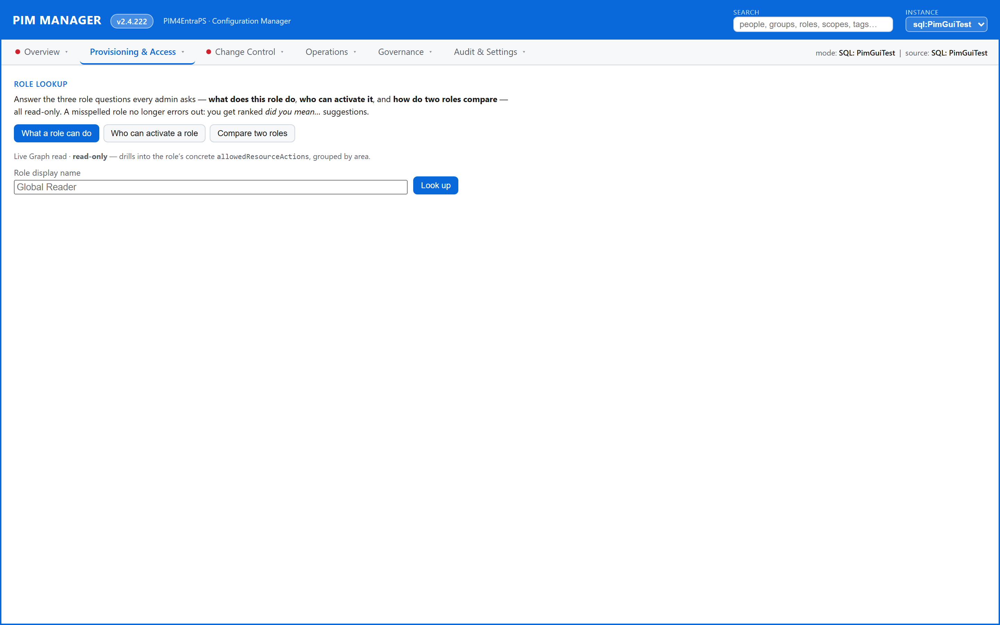
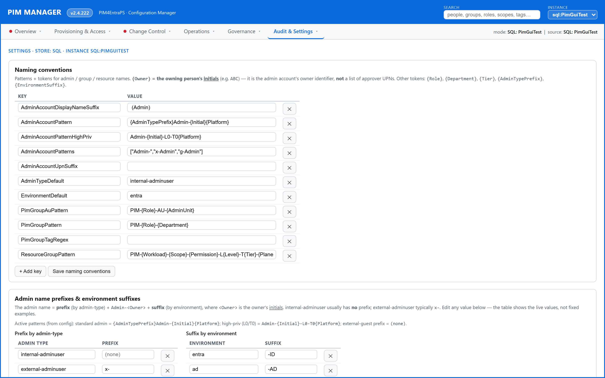

# PIM4EntraPS

> **Privileged-access governance for Microsoft Entra, as code.**
> Model your privileged delegation as nested groups, apply the right PIM
> policies, and keep everything in sync from a single source of truth —
> without ever standing up a public endpoint or leaving credentials lying
> around.

**PIM4EntraPS** turns a sprawling, click-driven Entra PIM model into a
**declarative model** that an engine reads, diffs against your tenant, and
applies. It is for **IT admins, platform teams and CISOs** who manage
privileged access at any non-trivial scale. A typical 30-admin /
200-permission-group tenant becomes: one model kept in sync by a single
engine run, a browser-based **PIM Manager** GUI to edit and validate it, and a
**PIM Activator** browser extension admins bulk-activate from. The engine talks
directly to Microsoft over secure web calls — no heavy PowerShell modules to
install or keep updated — and reads its model from **one governed database**.
It runs on a plain VM or in a lightweight container, and never needs a public IP.


*The PIM Manager opens on a Home / Overview dashboard — red/amber/green tiles
for engine and job health, validation findings, break-glass status,
delegation by tier and expiring access — every tile links to the screen that
owns the detail. (Screenshot uses synthetic demo data.)*

---

## Table of contents

- [Why PIM4EntraPS — what makes it different](#why-pim4entraps--what-makes-it-different)
- [Why this exists](#why-this-exists)
- [The core idea: group nesting](#the-core-idea-group-nesting)
- [What it does for you — feature by feature](#what-it-does-for-you--feature-by-feature)
  - [The single source of truth](#the-single-source-of-truth)
  - [The engine that keeps your tenant in sync](#the-engine-that-keeps-your-tenant-in-sync)
  - [One model, every workload](#one-model-every-workload)
  - [Automatic discovery of new resources](#automatic-discovery-of-new-resources)
  - [The delegation model — access done right](#the-delegation-model--access-done-right)
  - [Bringing in consultants and self-service](#bringing-in-consultants-and-self-service)
  - [Layered security and fail-closed access](#layered-security-and-fail-closed-access)
  - [Lifecycle, governance and approvals](#lifecycle-governance-and-approvals)
  - [Emergency break-glass](#emergency-break-glass)
  - [Notifications and email](#notifications-and-email)
  - [Naming that matches your organisation](#naming-that-matches-your-organisation)
  - [Built for very large tenants](#built-for-very-large-tenants)
  - [Tested for real, never faked](#tested-for-real-never-faked)
- [The PIM Manager (GUI)](#the-pim-manager-gui)
  - [One clear place to look — the Home dashboard](#one-clear-place-to-look--the-home-dashboard)
  - [Six menus instead of twenty tabs](#six-menus-instead-of-twenty-tabs)
  - [See who can do what — the Delegation Map](#see-who-can-do-what--the-delegation-map)
  - [Create access the natural way round](#create-access-the-natural-way-round)
  - [Review & Save — see exactly what will change](#review--save--see-exactly-what-will-change)
  - [Reports — "who can do what", and the reverse](#reports--who-can-do-what-and-the-reverse)
  - [Role Lookup — the three questions every admin asks](#role-lookup--the-three-questions-every-admin-asks)
  - [Validate — catch problems before they ship](#validate--catch-problems-before-they-ship)
  - [Jobs, Audit and Support](#jobs-audit-and-support)
  - [Settings — your operational policy in one place](#settings--your-operational-policy-in-one-place)
  - [Export everywhere, and a guided database cutover](#export-everywhere-and-a-guided-database-cutover)
- [The PIM Activator (browser extension)](#the-pim-activator-browser-extension)
- [Getting started / install](#getting-started--install)
  - [Community mode — quick start](#community-mode--quick-start)
  - [Internal mode — quick start](#internal-mode--quick-start)
  - [Keeping a deployment up to date](#keeping-a-deployment-up-to-date)
- [Hosting & containers](#hosting--containers)
- [MSP variant](#msp-variant)
- [Repo layout](#repo-layout)
- [Documentation](#documentation)
- [Versioning](#versioning)
- [Support / contributing](#support--contributing)

---

## Why PIM4EntraPS — what makes it different

Most privileged-access tools either drown you in portal clicks or hand you a
pile of spreadsheets to keep in sync by hand. PIM4EntraPS is built on four
ideas that set it apart. Each one is explained in plain language below; the
rest of this document then walks through every capability in detail.

### One governed database as the single source of truth — not CSV files

Everything that describes your privileged access — who the admins are, what
job functions exist, what each one can do, and where — lives in **one governed
database**. There are no scattered spreadsheets drifting out of sync, no "which
copy is the real one?", and no quarterly reconciliation exercise. You edit the
model in one place, the engine reads that same place, and the scheduled jobs
read it too — so what you see is always what the system actually does. (A
spreadsheet import exists, but only as a one-way migration route to *get* an
existing model *into* the database; once you're in, the database is the truth.)

### Layered security — privilege tiers, fail-closed access, MFA and approvals

Privilege is treated as something to be **layered and contained**, not granted
flat:

- **Privilege tiers and planes (L0–L5).** Every piece of delegated access is
  classified by how sensitive it is (tier) and which administrative plane it
  belongs to. The most privileged access is held to the strictest rules, and
  the model makes over-exposure visible instead of hiding it.
- **Fail-closed access.** If the system can't *prove* what an operator is
  allowed to do, it drops them to **read-only** rather than guessing generously.
  Safe-by-default is the default.
- **MFA on activation.** Activating privileged access can be required to be
  backed by a fresh multi-factor sign-in, so a copied script or a stale session
  can't quietly elevate.
- **Approval gates on sensitive changes.** The most powerful, Global-Admin-class
  delegation automatically requires approval at activation, with the approver
  resolved from the group's owners — a high-privilege group is never left with
  nobody able to grant it. Reconciliation is safe-by-default too: a normal run
  only creates and updates, and it refuses to wipe out real admins from a
  partial configuration.

### Delegation done right — admins → role groups → permission groups → targets

Access is never wired directly from a person to a role. Instead it flows
through **nested groups**: a person joins a **role group** (their job function),
which contains **permission groups** (atomic capabilities), which grant the
actual **targets** (Entra roles, Azure scopes, workloads). The payoff is huge:

- **Auditable** — the chain *is* the answer to "who can do what".
- **Refactorable** — change one permission group and every job function using it
  updates for free.
- **Offboard-safe** — removing a person is one deletion, and their entire access
  surface collapses with them.

### A modern, module-free engine

The engine connects **directly to Microsoft over secure web calls, using a
certificate to sign in** — never a shared secret, never a copy-pasted password,
never a fragile interactive prompt. There are **no PowerShell Graph or Azure
modules** to install, version-match or keep in lock-step, so it runs cleanly on
a plain VM or a lightweight container with nothing pre-installed.

### And two more standouts

- **Run it where it fits — hosted or local.** The Manager can run centrally for
  the whole team, or locally on an admin's own PC straight against the database.
  A break-glass edition runs on a client PC for the rare times a hosted plan is
  unavailable, so senior admins are never locked out. **No public IP is ever
  required.**
- **MSP: pull, never push.** For consultancies managing many customer tenants,
  each tenant *pulls* a cryptographically signed baseline into its own database.
  The provider never reaches into the customer tenant, customer data never
  leaves it, and every action is attributed to a named app inside the customer's
  own tenant.

---

## Why this exists

Managing PIM at any non-trivial scale through the Entra portal is painful:

- Per-admin onboarding is **N clicks** (one per role / scope / AU).
- "Add a new permission to the Cloud Engineer role" is **M clicks** (one
  per admin who has that role).
- Drift is invisible: nobody knows what's *actually* assigned vs what was
  documented last quarter.
- Audit asks "who can do X" — answering means clicking through every PIM
  blade and Azure RBAC scope.

**PIM4EntraPS replaces the clicks with a declarative model.** The model
lives in one governed database as a small set of related tables — one source
of truth instead of scattered spreadsheets:

| The model holds | Which says |
|---|---|
| Admin definitions | Who the admin accounts are |
| Role-group definitions | What *role groups* exist (job functions) |
| Permission-group definitions | What *permission groups* exist (atomic capabilities) |
| Admin assignments | Which admins are in which role groups (eligible / active) |
| Group assignments | Which permission groups nest inside which role groups |
| Entra-role assignments | What Entra ID roles each permission group grants |
| AU-role assignments | What AU-scoped Entra roles each permission group grants |
| Azure-resource assignments | What Azure RBAC scopes each permission group grants |

Run the engine → the tenant matches the model. Edit a row → run again → the
delta is applied. History is tracked. A spreadsheet import path exists as a
read-only migration source for getting an existing model into the database.

---

## The core idea: group nesting

Don't assign Entra/Azure roles directly to admins. Assign them to
**permission groups** (atomic capabilities). Nest permission groups into
**role groups** (job functions). Assign admins to role groups via PIM:

```
Admin                 Role Group              Permission Groups               Target
(the user)            (the job function)      (atomic capability)             (Entra / Azure / AU)

Admin-ABC           --E->  Role-              --E--> Entra-ID-                  --E--> "Application Administrator"
                           CloudEngineer              AppAdmin                          (Entra ID role)
                                                --A--> AzDevOps-                  --A--> "Build Administrator"
                                                       TeamsContributor                  (Azure DevOps role)
                                                --E--> AzRes-                     --E--> Owner on a subscription
                                                       Platform                          (Azure RBAC)
                                                --E--> PowerBI-                   --E--> Workspace contributor
                                                       ExampleWorkspace                  (Power BI)
```

`--E->` = Eligible (PIM activation required) · `--A->` = Active (always on)

**Why nest:**

- Onboarding a new Cloud Engineer = **one** assignment, not 20.
- Refactor a permission group's targets → every role group using it gets
  the change for free.
- Removing an admin = one deletion; their entire access surface collapses.
- The graph (admin → role → permission → target) *is* the audit answer to
  *"who can do X?"* — see the **[PIM Manager](#the-pim-manager-gui)**.
- Entra enforces a hard cap of **500 role-assignable groups per tenant**.
  Heavy reuse of permission groups + role groups across many admins keeps
  you well under the ceiling.


*The Delegation Map renders the nesting as an interactive graph: pick a
person and the board collapses to their transitive path (who reaches what,
through which groups). The **risk overlay** flags orphans, stale nodes and
over-privileged principals. (Synthetic demo data.)*

See **[docs/DESIGN.md](docs/DESIGN.md)** for the full philosophy: direct
vs indirect delegation, naming convention, tier model, lifecycle states,
the as-code pattern, customer overrides.

---

## What it does for you — feature by feature

This section explains every delivered capability in plain language —
benefit-first, no jargon. For the complete customer-facing catalog, see
**[docs/FEATURES.md](docs/FEATURES.md)**; work in progress lives in
**[docs/REQUIREMENTS.md](docs/REQUIREMENTS.md)**; per-release detail is in
**[RELEASENOTES.md](RELEASENOTES.md)**.

### The single source of truth

Your entire privileged-access model — configuration, settings, access rules
and delegation profiles — lives in **one governed database**, not in files or
shares you have to keep in step. The Manager, the engine and the scheduled
jobs all read and write the same store, so there is never a question of which
copy is current. Sign-in to the database is **passwordless**: in the cloud it
uses a managed identity (no database passwords stored anywhere), and on-prem it
uses your existing Windows sign-in. The Manager always shows you which database
you're connected to, and you can switch between databases from a dropdown.

For development and inner-loop work on a management server, the engine can also
read from a **local database using the signed-in machine** — no cloud
connection, no separate login. In production (and for break-glass), the cloud
database is always the single authoritative store; the local instance is a
developer convenience only.

The hosted database is kept **awake** so neither the health check nor the first
request after a quiet period suffers a cold start, and the health check
**tolerates a brief blip** — a single hiccup is reported as a transient warning
rather than taking the service down; only a sustained outage reports unhealthy.

### The engine that keeps your tenant in sync

The engine is the part that makes your tenant match your model. It is **modern
and dependency-free** — it talks directly to Microsoft and to the database with
no heavy PowerShell modules to install or keep updated, so it runs on a plain VM
or in a lightweight container.

- **From one run, everything gets set up.** Groups, delegations, organisational
  group access, time-limited access passes, admin schedules and notification
  emails — all created in a single pass, with nothing wired up by hand.
- **Fast incremental runs.** Instead of a one-to-two-hour full sweep every time,
  the engine queues changes and applies only what actually changed, scoped to
  the area you ask for. A full reprocess is still available when you want it.
- **Clear, readable logs.** Every action is one tagged line (assign / update /
  extend / remove / OK); errors name the actual resource or role, not an opaque
  ID; and a full transcript is kept for each run.
- **Safe by default.** A normal run only creates and updates. Removing live
  access that isn't in your configuration is a separate, explicit opt-in — and
  the engine refuses to "prune" an area whose desired set is empty, so a partial
  or half-loaded configuration can never wipe out real administrators. Before any
  run touches your tenant, it checks that the model is real and the identity is
  valid, and refuses to start otherwise — a wrong identity fails immediately, not
  half-way through.

### One model, every workload

A single PIM group can grant access across many Microsoft workloads — you model
it once and the engine translates it into the right access everywhere:

- **Entra ID roles** (tenant-wide or scoped to an administrative unit).
- **Azure RBAC** at any scope (management group, subscription, resource group,
  resource).
- **Power BI / Fabric** workspaces.
- **Microsoft Defender XDR** security roles (Unified RBAC).
- **Intune / device management** roles, optionally limited to specific scope
  tags.
- **Gallery enterprise apps** such as SAP or ServiceNow.
- **Dataverse / Dynamics 365.**

Admins get the workload access simply by being a member of the group.
Assignments are matched against what already exists, so re-running never
creates duplicates, and a role you no longer want is only removed when you
explicitly ask. Roles are **imported from the live service list** so you pick
from real, current roles instead of risking a typo.

### Automatic discovery of new resources

New resources become ready-to-delegate access groups **on their own**:

- **New Power BI workspaces, Azure subscriptions and management groups** are
  proposed as correctly-named, tier- and plane-classified access groups minutes
  after they appear — so a new resource is delegable almost immediately, with
  the same structure as everything else.
- **Renames are tracked, not duplicated.** A resource that is renamed or moved
  is matched by its stable identity and the existing group is renamed in place —
  you never end up with an orphan plus a duplicate.
- **It proposes, it never auto-grants.** Discovery creates the empty container;
  who actually gets in stays a human decision.
- **New built-in roles** (Entra, Defender, Intune) are catalogued automatically
  so you can pick them, and a role you've already handled never shows up as "new"
  again — each run surfaces only what you haven't dealt with yet.
- **Import your departments straight from Entra.** Point it at a group naming
  pattern (for example `ORG-*`) and one click pulls every matching group in as a
  department for approval routing, bringing each group's owners along as that
  department's approvers. Re-import any time — existing imports refresh in place,
  nothing is duplicated, and anything you added by hand is left alone.

### The delegation model — access done right

This is the heart of PIM4EntraPS. Admins are added to **direct groups** (by
role, task, process, cross-organisation or department), which nest into
**permission groups** that hold the actual roles and scopes. The result is
least-privilege access across many apps, by reuse rather than by hand.

- **Everything you grant is a group.** Administrative units and Azure scopes are
  only the *where*, never the *who* — delegation is simply group membership.
- **Every group has an owner, automatically.** A group is never created without
  one; the owner is resolved from the assignment, the role's sponsor, or the
  department-to-owner mapping. Owners are also the approvers for any
  approval-required policy.
- **Scoped portal admins.** A delegated admin sees only the groups they own, and
  even the admin list is filtered so they can't see the most privileged tiers.
  Super-admins bypass the scoping when they need to.
- **Two clearly separated approvals.** *Delegation approval* (who may join a
  group) is handled by the solution and routed to the responsible department.
  *Activation approval* (approving an activation in the moment) is handled
  natively by Microsoft Entra PIM. The two are never confused, and the solution
  turns any department or role persona into the actual named people before it
  configures a policy — and refuses to publish an approval rule that would end up
  with nobody able to approve.
- **Network-reach classification (opt-in, off by default).** Each delegation can
  carry a network-reach classification derived from its tier, plane and level —
  for example confining the most privileged tier to a privileged-workstation
  (PAW) segment. It is **off by default**, so a tenant that doesn't run
  privileged workstations is never blocked; turn it on with a single setting when
  you're ready, and emergency super-admin access is never locked out.

### Bringing in consultants and self-service

- **Invite an external consultant in one step.** Bring a consultant in as a
  cloud guest *and* place them into the right delegation group at the same time.
  The invitation, their admin record and their group membership are all staged
  for the normal Review & Save flow — nothing is granted until you confirm.
  Guest invitation is cloud-only and gated by a specific delegation right.
- **Self-service consultant enable/disable.** A department or service owner can
  switch one of *their own* managed consultants on or off without a central
  request — only for the consultants they manage, queued as a normal, audited
  account change.
- **Local self-service delegation.** When you run the solution for your own
  organisation, your local IT can self-grant any permission — full local
  autonomy. In a managed-service setup that self-grant path is closed instead,
  and specific privileged groups can be pinned as "enforced" so they can never be
  locally overridden. A self-delegation is always recorded as an ordinary
  assignment, so it is audited and offboarded like everything else.

### Layered security and fail-closed access

Security is layered through the whole product, not bolted on:

- **Privilege tiers and planes (L0–L5)** classify every delegation by how
  sensitive it is and which plane it lives on, so the most powerful access is
  held to the strictest rules and over-exposure is visible.
- **Fail-closed.** When the Manager can't determine what an operator is allowed
  to do, it drops to **read-only** rather than assuming the best. The role tiers
  (Reader / Admin / Super-Admin / Delegated) gate exactly what each operator can
  do.
- **Certificate sign-in, no secrets in configuration.** The engine signs in as
  an application using a certificate (not a shared secret), and access uses a
  managed identity or a key-vault pointer — seed files never carry secrets.
- **It tells you exactly which permission is missing.** When a call is refused,
  you don't get a bare "access denied" — you get the precise permission to grant
  (for the automation identity) or the privileged role to activate (when you're
  signed in as yourself), and the one script that grants it.
- **It always shows the account picker** and forces a fresh sign-in if the cached
  account isn't the one you expected, so you can't accidentally act as the wrong
  identity. On-prem Active Directory failures are **explained** — the identity it
  ran as, whether it had a domain logon and Kerberos tickets, and whether a
  domain controller was reachable — so you know whether to fix the credential,
  the network, or the target.
- **MFA-gated admin console (optional).** The privileged Manager console can
  require a fresh multi-factor sign-in before it opens, so a copied script can't
  be replayed without you passing MFA. When the console runs centrally behind a
  sign-in gateway, that already enforces MFA and the local gate stays out of the
  way.

### Lifecycle, governance and approvals

PIM4EntraPS manages privileged access across its whole life, not just at
creation:

- **Scheduled account creation + time-limited access pass.** Admin accounts can
  be staged for a future date and time (plain or symbolic, e.g. "the first
  workday of next month"). The access pass is held back until just before it is
  needed, so a pass scheduled weeks out isn't issued early — and an account is
  never created twice.
- **Lifecycle calendar with reminders and auto-renewal.** A single pass produces
  a calendar of access expiring soon, sends escalating reminders to the right
  people as the deadline nears (paced so nobody is spammed), and automatically
  renews items explicitly marked for it before they lapse.
- **Access review with a feedback loop.** Owners approve continued access before
  it's extended. A removal decision is **remembered**, so the engine never
  silently re-adds someone an owner just removed — the most recent decision
  always wins.
- **Optional audit to Log Analytics.** On top of the always-on local audit, every
  change can optionally be forwarded to Azure Log Analytics (off by default, one
  setting to enable).

### Emergency break-glass

In a genuine emergency, an authorised super-admin can temporarily lift the
approval requirement on the affected access, gated by a passphrase. The
passphrase is verified against a secret in your key vault (with a local
fallback) using a timing-safe comparison, with a short lockout after repeated
wrong attempts and a bounded lifetime (defaults to 4 hours, capped at 24).
Every step is audited, owners are notified, and normal policy is restored
automatically when the window closes. Crucially, it **works from a client PC**,
so senior admins are never locked out even if the central console is down.

### Notifications and email

- **Built-in, template-driven email.** New admin, new role, new permission and
  access-pass delivery are all sent by rendering customisable HTML templates.
  Rendering is separated from sending so you can preview, and a lab redirect
  keeps test mail out of real inboxes. New-admin access-pass codes can be fanned
  out to any combination of email, Teams and Slack; a delivery failure never
  blocks account creation.
- **Edit templates in the portal — no rebuild.** Open a template under
  Governance → Mail templates, change the wording, save — your version is stored
  centrally and takes effect immediately, surviving restarts and updates. The
  portal shows which templates are still the shipped default and which you've
  customised, with one-click **Reset** to the original.
- **Get told when something goes wrong.** Choose who is emailed and which events
  raise an alert — an engine/job run failure, configuration drift, access
  expiring soon, or break-glass use — from the Alerting panel. A test button
  confirms the wiring; if no sender mailbox is configured yet, the panel says so
  plainly rather than silently dropping the alert.

### Naming that matches your organisation

Customer naming styles vary widely. PIM4EntraPS captures **your** convention in
configuration — never hardcoded — using simple tokens for initials, level, tier
and platform, with per-tenant overrides. That one convention then drives three
things at once: the engine's large-tenant performance (it queries only your
PIM-managed objects by prefix), the Manager's wizards (which suggest correctly
named groups), and the validator (which warns on convention drift). You can
match your own style without touching code.

### Built for very large tenants

The solution is designed never to choke on scale. It **never bulk-lists**
hundreds of thousands of users or groups — it looks users up on demand and
queries only the PIM-managed groups by name prefix on the server side, so
context builds in seconds even in very large directories. Tenant-wide role
schedules are read once and indexed; anything that already exists is skipped;
access durations that are too long are retried shorter; and there are **no
artificial caps** — scaling is empirical (measure, adapt, prune), never
arbitrary "max N" limits that hide real problems.

### Tested for real, never faked

Validation runs against **real test tenants** — actually creating groups,
delegations, organisational group access, emails, time-limited passes and
schedules, then verifying and cleaning them up. Test data lives under a
dedicated marker so it never touches production groups, and a rerunnable offline
suite covers the engine and Manager flows. After a first-time deploy, an
automated suite reads the desired configuration straight from the database and
confirms — against the live tenant — that **every** group, administrative unit,
role assignment, admin delegation and approval policy was actually created.

---

## The PIM Manager (GUI)

The PIM Manager is a browser-based editor and dashboard for your whole
privileged-access model. It reads the model from the database and serves a
single-page app in your browser, on the same light palette as the PIM Activator
extension. You can run it centrally for the team or locally on your own PC
against the same database.

### One clear place to look — the Home dashboard

The Manager opens on a **Home / Overview** dashboard instead of dropping you
into a graph. It summarises the health of your privileged-access estate in clear
red/amber/green tiles, each of which jumps to the screen that owns the detail:

- **Failed jobs / engine health** — how many background jobs failed, what's
  running now, when the last run was and whether it succeeded, and when the next
  is due (so an overnight failure is visible the moment you log in).
- **Validation findings** — the current count of blocking errors and warnings.
- **Break-glass** — whether an emergency override is active right now, who
  activated it, and when it expires.
- **Delegation by tier (L0–L5)** — how your delegation groups spread across
  privilege levels.
- **Gaps, orphans & unmanaged** — groups that reach nothing, admins who reach
  nothing, and targets no group manages.
- **Expiring access (next 14 days)** and **pending access reviews** — what needs
  renewing, revoking or deciding soon.

Every tile is backed by real data with an honest empty state — there are no
decorative or dead tiles — and a red badge shows the total number of items
needing attention. (See the Home dashboard screenshot at the top of this page.)

### Six menus instead of twenty tabs

The Manager folds its ~20 underlying screens into **six clearly-named top-level
menus**, so a security leader or a first-time admin can find anything in
seconds.


*Six top-level menus — Overview · Provisioning & Access · Change Control ·
Operations · Governance · Audit & Settings — fold ~20 screens into one
scannable bar. Each menu carries an attention dot + per-item count.
(Synthetic demo data.)*

| Menu | What lives under it |
|---|---|
| **Overview** | The Home dashboard and its attention tiles. |
| **Provisioning & Access** | The Delegation Map, grid editors, the target-first create wizard, ready-made template packs, and the Authoring and Onboarding panels. |
| **Change Control** | The keyed Review & Save diff preview before commit. |
| **Operations** | The Jobs panel (scheduled background work, live tail) and the database Cutover ceremony. |
| **Governance** | Validate, Access Review, Reports ("who can do what"), Role Lookup, and editable mail templates. |
| **Audit & Settings** | The Audit history, Settings / operational policy, alerting, departments import, AD OU placement and naming. |

The grouping is a **pure navigation layer** — nothing was removed or renamed,
and the classic flat tab strip is still there underneath. A **global search box**
in the header jumps to any person, group, role, scope or tag across the whole
estate: a person or role opens its "who can do what" report; a group, scope or
tag focuses it on the Delegation Map.

### See who can do what — the Delegation Map

The Delegation Map renders your nesting as an interactive graph: admin → role
group → permission group → target (shown above in [The core idea](#the-core-idea-group-nesting)).
Pick a person and the board collapses to their transitive path. Beyond the
graph itself:

- **The fourth column spells out the actual permissions.** Select any capability
  bundle or role group and **Permissions & Targets** shows exactly what it grants
  — grouped into Entra ID roles, AU-scoped roles and Azure RBAC at scope — with a
  short readable label and the full detail (the complete scope path and its kind)
  on hover or click-to-expand. Everything is read live from your real data.
- **Search gives a clickable result list and jumps you there.** Typing produces a
  typed, ordered list (people first, then groups, then roles and scopes); clicking
  a result centres and selects that object so its full reach lights up. Arrow
  keys and Enter pick the top hit without the mouse.
- **A risk overlay shows what to clean up.** A toggle highlights **orphans** (a
  delegation nobody can reach, or a target nobody reaches), **stale** nodes (past
  their review horizon, when your data carries a last-reviewed date), and
  **over-privileged** principals (anyone reaching a Tier-0/Tier-1 target, or an
  unusually large number of targets). The "unusually large" line is learned from
  your own estate — not a fixed number — so it stays meaningful whether you have
  ten delegations or ten thousand. Hover any flagged box for the exact reason.
  (See the Delegation Map screenshot in [The core idea](#the-core-idea-group-nesting)
  above, with the risk overlay on.)
- **It reads spreadsheet exports correctly** — quoted headings, an invisible
  leading mark, a space after the separator: all cleaned quietly so a perfectly
  valid export shows your real delegation instead of rendering blank.

### Create access the natural way round

The Manager turns "author a group by hand" into a guided flow:

- **Target-first create wizard.** Instead of inventing a group name and guessing
  its level and tier, you pick **what** you delegate (an Entra service, an Azure
  scope, or a workload), then **where** (the subscription / management group /
  administrative unit), then the **roles** you want there. The wizard derives the
  rest — whether it's a single-role service group or a multi-role bundle, the
  correct name, and the level, tier and plane (Global-Admin-class roles become the
  most privileged tier; an Azure subscription sits a tier below the tenant root; an
  AU-scoped role drops a level). The AU step only appears when every role you
  picked supports it.
- **Ready-made template packs.** Adopt a curated, best-practice set of permission
  groups with one click instead of authoring by hand. Packs cover Microsoft
  Defender XDR, Microsoft Sentinel, Intune / Endpoint Manager, Exchange Online, a
  generic Azure RBAC pack, and a common Entra ID role pack — each named and tiered
  correctly out of the box, with the Manager showing exactly which rows your
  instance doesn't have yet.
- **Grid editors and authoring helpers.** A spreadsheet-style editor per table
  (add / edit / delete, multi-select with bulk actions), plus authoring helpers
  that turn many clicks into one: bulk-attach several roles/scopes/AUs to a group,
  clone a role or group onto several new ones, an AU wizard, admin bulk-import
  (paste a list of people and have each row expanded against a template), and a
  replace-mode admin move (remove the old grant and add the new one together).
- **Authoring and Onboarding panels** put these helpers behind simple forms. Both
  only **prepare** changes — the engine remains the only thing that ever writes to
  your tenant.

### Review & Save — see exactly what will change

Before anything is committed, Review & Save previews exactly what the change will
do.


*Review & Save previews exactly what a commit will do. The diff is keyed by
each row's natural identity, not its position — so reordering rows correctly
shows no changes — and validation errors block the commit. (Synthetic demo
data.)*

The diff is **keyed by each row's natural identity, not its position in the
list**. So if you simply move rows around — after a spreadsheet round-trip, a
sort, or an authoring reorder — the preview correctly shows **no changes**
instead of falsely flagging modifies, removes and adds. A genuine edit shows as
exactly one modify with the changed columns highlighted, a new row as one add,
a deleted row as one remove. If two rows can't be told apart by their key, it
falls back to comparing them by content rather than guessing — so it never
miscounts. Validation errors block the commit. The result is a diff you can
trust to say exactly what the commit will do.

### Reports — "who can do what", and the reverse

The Reports tab answers the two questions every access audit starts with,
instantly and with evidence to hand to auditors.


*The Reports tab answers "who can do what" (and the reverse): pick a person
and see every privileged target they can reach with the exact path that grants
it through the nested groups. Real reachability, printable and CSV-exportable.
(Synthetic demo data.)*

- **Pick a person → everything they can reach.** Every privileged target they
  can activate — Entra roles, AU-scoped roles and Azure resource roles — and, for
  each, the **exact path** that grants it through the nested groups. It is real
  reachability: access inherited through nested groups is followed and shown, not
  flattened.
- **Pick a role → who can activate it.** The reverse view lists everyone who can
  reach that role, again with the path, and honestly reports zero when nothing
  grants it.

Both read the live delegation model and are printable and exportable to CSV.

### Role Lookup — the three questions every admin asks

Role Lookup is a read-only tool that answers the three questions admins ask about
roles, and forgives a typo while doing it.


*Role Lookup answers the three role questions every admin asks — what a role
can do, who can activate it, and how two roles compare — typo-tolerant and
read-only. (Synthetic demo data.)*

- **What a role can do** — a permission drill-down read live from the tenant,
  grouped by area, so you can see exactly what a role grants *before* you delegate
  it. It is **typo-tolerant**: a misspelled or partial name gives a ranked "did
  you mean…" list of the closest real roles rather than an error.
- **Who can activate a role** — pick a role and see every person who can activate
  it, each with the exact granting path. It honestly reports "no one" when nothing
  grants the role.
- **Compare two roles** — see who can activate both versus only one, side by side
  — ideal for spotting overlapping privilege or confirming a least-privilege
  split.

When the directory connection isn't up yet, it shows a clear "not available yet —
connect and retry" message rather than a technical error.

### Validate — catch problems before they ship

The Validate tab is a pre-flight rule engine that checks your model for problems
before they reach your tenant. It covers things like broken references,
tier/naming drift, orphans, stale or never-activated groups, missing
owners/sponsors, admins without a strong (phishing-resistant) sign-in method,
and Azure assignments pointing at a subscription, resource group or resource
that no longer exists. Each finding comes with a **plain-language fix
suggestion**, and you can apply a one-click **Bulk Fix-all** or per-finding
inline fixes.

### Jobs, Audit and Support

- **Jobs** — a read-only view of the scheduled background work that keeps your
  environment in sync (cache refresh, reminder/escalation checks, per-area
  reconciliation, daily-summary and Tier 0/1 reports, discovery passes). Anything
  running now is at the top; everything else shows its schedule, enabled state,
  last run and result, and next due time, with a **Logs** button and **live tail**
  for in-progress runs.
- **Audit** — the full, searchable, append-only history (newest first): when, who,
  action, target, result. One-click category filters — logins, delegation changes,
  account and access-pass activity, approvals, engine actions and emergency
  overrides — each chip showing how many events it holds. Sign-ins to the Manager
  are recorded too. Strictly read-only; it reflects the tamper-evident record and
  never changes anything.
- **Support** — a one-click self-check (**Run checks** tests the database,
  Microsoft Graph and Azure, with a plain-language fix on each failure) plus a
  health summary and a **sanitised diagnostics bundle** you can safely attach to a
  support request — secrets, certificates, tokens, connection-string credentials
  and full tenant/subscription IDs are all masked out before the file is produced.

### Settings — your operational policy in one place

Settings keeps the core operational defaults in one place, saved to the same
store the engine and jobs read — so what you see in the panel is what the system
actually uses.


*Settings keeps the core operational defaults in one place — expiry defaults
and ceiling, require-MFA-on-activation, connection-sanity, naming conventions,
departments import and AD OU placement — saved to the same store the engine and
jobs read. (Synthetic demo data.)*

- **Operational policy** — the default and maximum length of a time-bound
  activation and the ceiling for an eligible assignment; a single **require MFA on
  activation** toggle; and the connection-sanity timeouts and required checks.
  Invalid entries are **rejected or safely clamped with an explanation** — never
  silently dropped — and a secure default (MFA on, conservative durations) is
  always in place.
- **Departments and approvers** — import departments from Entra by naming pattern,
  bulk-import approvers/owners from a simple CSV, and clearer wording that
  distinguishes the *initials* naming token from the *people* listed as approval
  owners.
- **AD OU placement** — read and edit, in place, the on-premises organisational
  units where new admin accounts are created (one for general admins, one for
  high-privilege admins) without editing config files.
- **Alerting** — the panel described under [Notifications and email](#notifications-and-email).

### Export everywhere, and a guided database cutover

**Export everywhere.** The Reports, Delegation Map, Validate, Access Review and
Audit views each carry **Export CSV** and **Print**. Exports are
spreadsheet-safe — values that could be read as formulas are neutralised, so a
CSV opened in a spreadsheet can never execute injected content — and print
produces a clean, titled, date- and tenant-stamped page, not the whole app. The
Manager also reads spreadsheet-saved (semicolon) CSV correctly.

**Guided database cutover.** Moving an existing file-based instance onto the
database is a guided, gated ceremony — never a risky one-shot switch. It runs in
order: a read-only **pre-check** (connectivity plus a report of exactly what the
upgrade will change), a one-time **schema upgrade**, a **transactional import**
of your existing configuration (all-or-nothing — a failure leaves the store
exactly as it was), a **switch** of the configuration source to the database, a
**re-check** against the now-populated store, and an explicit **Finalize
Cutover** confirmation. Your existing files are only ever **read** (never written
back), every imported row count is recorded for audit, and the cutover **refuses
to finalise onto a development/local database** — only a production-grade
database may become authoritative.

See **[tools/pim-manager/README.md](tools/pim-manager/README.md)** for the full
Manager docs.

---

## The PIM Activator (browser extension)

The PIM Activator is a browser extension for **Edge and Chrome** that turns
activating your privileged access from N portal navigations into **one click**.
The admin clicks the toolbar icon, ticks the PIM groups they need from a
checkbox list, enters a justification and duration, and clicks **Activate** —
done.

- **One-click bulk activation.** It covers eligible Entra roles, Azure RBAC and
  group-based access, and **expands the nesting**: activating one role group folds
  out the permission groups inside it and everything they grant, so a single
  activation lights up the admin's whole job-function access surface.
- **See and manage what's active.** A **My Access** tab shows what's currently
  active with a live expiry countdown, favourites, and single or bulk
  self-deactivation — and it hides empty categories so you only ever see what you
  actually have.
- **A confirm step for large activations.** When you activate several roles at
  once, the button asks you to click again to confirm — a quick guard against an
  accidental over-elevation. Small selections activate straight away, and the
  threshold is an **administrator setting per tenant** (lower it for caution,
  raise it for power users), never left to individual users.
- **A one-time getting-started tip** points new users at bulk-activate and My
  Access, and never comes back once dismissed.
- **Simple, secure sign-in** uses the browser's built-in flow — no extra software
  to bundle — with a first-run onboarding wizard when nothing is configured yet.
- **Works for one tenant or many.** Point it at a single tenant for a silent
  experience, or publish a multi-tenant catalog centrally so admins get a tenant
  switcher.
- **Fleet-friendly deployment.** Ship it to managed devices through Intune, or
  straight to the browser policy on non-managed boxes (per-machine or per-user),
  with automatic updates from a published feed and self-healing recovery for the
  rare case a browser marks the extension corrupted.

See **[tools/pim-activator/README.md](tools/pim-activator/README.md)** for the
full deployment matrix (Intune, non-Intune client, multi-tenant catalog,
conflict handling and backend setup).

---

## Getting started / install

PIM4EntraPS deploys in one of **two modes**. Pick the one that matches you:

| Mode | Who it's for | What you run | Where it runs |
|---|---|---|---|
| **Community** | Anyone running it for their own tenant; smallest footprint | The engine + local Manager from the public **community edition** | A management VM (or your own container) you already have |
| **Internal** | A 24/7 hosted platform (single-tenant or MSP) | The **setup-script family** (`Setup-PimContainers` / `Setup-PimVM` / `Setup-PimMsp`) | Azure Container Apps, a Windows VM, or per-customer containers |

Both modes share one engine (no PowerShell modules required), one database
model, and one identity model (an **engine app authenticating with a
certificate** — never a client secret, never device-code). The difference is
only *where it runs* and *how it's wired up*.

> **Full deploy detail + the update-lifecycle runbook:**
> **[docs/DESIGN.md §11.5 — Install & implementation guide](docs/DESIGN.md)**.
> The quick-starts below get you running; DESIGN has the exhaustive per-mode
> steps, the Azure topology, and the update lifecycle.

### Shared prerequisites (both modes)

- **Windows PowerShell 5.1** (PowerShell 7 also works; the engine and setup
  scripts are 5.1-safe). The hosted container ships its own runtime.
- **An engine app registration + certificate** with the engine permissions
  admin-consented, plus **User Access Administrator** at the Azure scope(s) the
  engine manages. The one-shot installer creates all of it:

  ```powershell
  az login        # as Global Administrator or Privileged Role Administrator
  .\tools\setup\Install-PimEngineAppRegistration.ps1 `
      -DisplayName "PIM4EntraPS Engine" -GrantConsent
  ```

  It mints (or reuses) a certificate in the machine store, grants the
  permissions and Azure RBAC, and writes the resolved identity into the launcher
  config. **No client secret and no device-code flow are used or supported
  anywhere.**
- **A database for the model.** A cloud **Azure SQL** database (Entra /
  managed-identity auth only — no database logins) is the single authoritative
  store in every mode. A local **SQL Express** instance (integrated Windows auth)
  is supported as a **development convenience only** — never as a production or
  break-glass store.

### Community mode — quick start

Run the engine + local Manager against your own tenant.

```powershell
# 1. Get the code (community edition). Update later with `git pull`.
git clone https://github.com/KnudsenMorten/PIM4EntraPS.git
cd PIM4EntraPS

# 2. Create the engine app + cert (see "Shared prerequisites" above).
az login
.\tools\setup\Install-PimEngineAppRegistration.ps1 -DisplayName "PIM4EntraPS Engine" -GrantConsent

# 3. Configure via the gitignored *.custom.* files (your data never leaves the box).
foreach ($sample in Get-ChildItem .\config\*.custom.sample.*) {
    $target = $sample.FullName -replace '\.custom\.sample\.', '.custom.'
    if (-not (Test-Path $target)) { Copy-Item $sample.FullName $target }
}
#   Set your database coordinates and the engine identity (tenant / client id /
#   cert thumbprint) in the launcher's LauncherConfig.custom.ps1.

# 4. Run the engine, driven by scope + mode. Always dry-run first:
.\tools\pim-engine\Invoke-PimEngineCore.ps1 -Scope All -Mode Full -WhatIf
#    Apply a full reconcile (create/update only — never deletes without -Prune):
.\tools\pim-engine\Invoke-PimEngineCore.ps1 -Scope All -Mode Full
#    Apply just one area, incrementally:
.\tools\pim-engine\Invoke-PimEngineCore.ps1 -Scope EntraRoles -Mode Delta

# 5. Open the local Manager (browser editor against the same database).
.\tools\pim-manager\Open-PimManager.ps1
```

The shipped `config\` templates include documented samples with worked example
rows — including a catalog of common Entra built-in roles — so you start from a
working model, not an empty schema. A spreadsheet import is a **read-only
migration source**; the running model lives in the database. Transcript logs
land in `logs/`; engine output in `output/` (both gitignored).

### Internal mode — quick start

Stand up a 24/7 hosted platform with the setup-script family. Containers (Azure
Container Apps) is the primary path; a Windows VM and an MSP per-customer variant
share the same model.

```powershell
az login        # to the target subscription/tenant

# 1. Engine app registration + cert + grants (as in shared prerequisites).
.\tools\setup\Install-PimEngineAppRegistration.ps1 -DisplayName "PIM4EntraPS Engine" -GrantConsent

# 2a. Containers (Azure Container Apps) — internal-only env, private ingress.
.\tools\setup\Setup-PimContainers.ps1 -SubscriptionId <sub> -TenantId <tenant> ...

# 2b. ...or a Windows VM host instead of containers:
.\tools\setup\Setup-PimVM.ps1 -SqlServerFqdn <server> -SqlDatabase <db> -TenantId <tenant>

# 2c. ...or an MSP per-customer deployment (build-once / import-per-customer):
.\tools\setup\Setup-PimMsp.ps1 -CustomerName <slug> -SubscriptionId <sub> ...
```

The setup scripts are idempotent and re-runnable. They wire passwordless,
managed-identity database access, the engine permissions and the Manager DNS
record. The Manager runs on a **private** address on an internal-only
environment — never a public endpoint — and should sit behind a sign-in gateway
with inbound restricted to your management / privileged-workstation subnets. See
**[docs/DESIGN.md §11–§12](docs/DESIGN.md)** for the full topology and **§11.5**
for the step-by-step internal runbook.

### Keeping a deployment up to date

Updates run through a single controlled lifecycle — **detect → build → deploy →
verify → notify → ensure-monitor** — never an unconditional "take whatever is
newest". In **community mode** it's a `git pull` plus a guarded update check
(apply a schema upgrade and rebuild the local Manager only when needed). In
**internal mode** it pulls the released image, rolls the deployment with **zero
downtime**, applies any schema upgrade, runs the hosted smoke check, and
**auto-rolls-back on failure**. Every update is a dry-run by default; applying is
explicit. See **[docs/DESIGN.md §11.6 — Update lifecycle runbook](docs/DESIGN.md)**.

---

## Hosting & containers

Run it where it fits. The Manager can run centrally for the whole team, or
locally on an admin's PC straight against the database — no central web server
required. A loopback **break-glass** edition runs on a client PC for when a
hosted plan is unavailable, so senior admins are never locked out. **No public
IP is ever required.**

For unattended runs, **one configurable engine image** runs as manager,
scheduler, engine, connector, queue worker or discovery job — you tell each
instance which roles to take on. It is headless and safe by default:
managed-identity auth, no interactive prompts, no secrets baked into the image,
and dry-run-by-default so a misconfigured job plans instead of applies. The
identical logic also runs on a plain Windows VM — same code, different host.
Container = zero-VM cloud-native option; VM = on-prem option; both first-class.

See **[docs/DESIGN.md §11–12](docs/DESIGN.md)** for the full hosting and
container topology.

---

## MSP variant

For consultancies managing many customer tenants, the model is **pull, never
push**:

- **Each customer pulls a signed baseline** into its own local database — the
  provider never writes to the customer tenant, and customer data never leaves
  it. Each customer has its own isolated store with no cross-customer visibility;
  the provider keeps only the central template.
- **The acting identity is always local.** Each customer tenant has its own
  engine app and non-exportable certificate, so the customer owns its Conditional
  Access, its audit attribution (actions log as a named app in *their* tenant),
  its lifecycle and instant revocation. There is no GDAP and no foreign
  multi-tenant identity — which is what makes this work for EA/MCA enterprises that
  GDAP can't cover, and avoids the "who is this GUID from the partner tenant?"
  audit problem.
- **Signed, not encrypted; no secret at the receiver.** The baseline (and the
  license) are signed with a private key held only on the provider host and
  verified against a public certificate embedded in the product. The customer side
  needs no secret key — it only verifies — and because bundles are signed rather
  than encrypted, the customer can read exactly what is shipped. Tamper, forge,
  roll-back and replay are all rejected.
- **Choose the sync model that fits your governance.** Pull a signed baseline,
  pull a versioned template by rollout ring, read the central template read-only at
  run time, emit a signed status summary back to the provider, or run fully
  autonomously. **Every** option is initiated by your own tenant.
- **One image, mirrored into your own registry.** The engine container is built
  once by the provider and mirrored directly into *your* registry, so nothing is
  rebuilt per customer and no image bytes pass through an intermediate host. The
  image carries **no secrets and no customer data** — identity, database and
  configuration are all supplied locally at run time.
- **One shared platform for related tools.** Companion tooling (such as tenant
  management) reuses the exact same registry, authentication and storage model
  rather than a separate parallel system — fewer moving parts and one consistent
  security posture.
- **Instant kill-switch with CISO opt-in.** A separately signed central-kill
  instruction lets an authorised owner disable or revoke a specific privileged
  account across every managed tenant at once — applied locally by your own engine
  through the same audited path as any other change, never a back-door write. The
  variant gates centrally-issued `Disable` / `Revoke` actions behind a per-admin
  secret in the **customer's** key vault: no match = refuse and warn.

See **[docs/DESIGN.md §13](docs/DESIGN.md)** for the full MSP architecture
(two-DB model, pull-not-push transport, signed-baseline + kill-switch,
ring-based rollout, why-not-GDAP).

---

## Repo layout

```
PIM4EntraPS/
  engine/
    _shared/PIM-EngineCore.ps1                  # engine core (direct API + database)
    _shared/PIM-EngineProviders.ps1             # per-scope appliers (connectors)
    _shared/PIM-Functions.psm1                  # shared function library
  tools/
    pim-engine/Invoke-PimEngineCore.ps1         # engine entry (-Scope / -Mode)
    pim-manager/                                # browser SPA — consolidated 6-menu Manager
      Open-PimManager.ps1                       # server + static export
      README.md
    pim-activator/                              # Edge/Chrome extension (bulk activation)
      Deploy-PimActivator*.ps1                  # Intune / client deploy + recovery
      README.md
  launcher/
    <task>/launcher.<flavour>.ps1               # community/internal × vm/azure
    <task>/LauncherConfig.*.ps1                 # layered config (defaults/locked/custom)
  config/        *.custom.sample.* templates (worked rows); *.custom.* gitignored
  config-msp/    MSP per-customer config + template-pull
  setup/         Install-PimEngineAppRegistration.ps1, setup-script family
  sql/           idempotent schema (CREATE + ALTER) + seed
  infra/         container / hosting deployment
  legacy/        module-based reference engines (incremental retirement)
  docs/          FEATURES.md · DESIGN.md (public) · REQUIREMENTS.md · TESTS.md (internal) · img/
  README.md
  RELEASENOTES.md
  VERSION
```

---

## Documentation

The doc set (public unless marked internal):

- **[docs/FEATURES.md](docs/FEATURES.md)** — public, customer-facing catalog of
  delivered + verified features. This README's "what it does for you" section
  mirrors its structure.
- **[docs/DESIGN.md](docs/DESIGN.md)** — architectural deep dive: nesting,
  delegation, naming, tier model, hosting, MSP, data model, connectors,
  lifecycle/governance.
- **[RELEASENOTES.md](RELEASENOTES.md)** — curated changelog (what changed each
  release + migration notes).
- **[tools/pim-manager/README.md](tools/pim-manager/README.md)** /
  **[tools/pim-activator/README.md](tools/pim-activator/README.md)** — per-tool
  deployment docs.
- **Internal (not published):** `REQUIREMENTS.md` (open backlog), `TESTS.md`
  (test suites + results), `CLAUDE.md` (working agreement + router).

---

## Versioning

Semver-ish: `MAJOR.MINOR.PATCH`.

- `MAJOR` — breaking layout / schema / launcher contract change.
- `MINOR` — additive engine or tool.
- `PATCH` — fix / doc / workflow polish.

Each release is tagged twice on the monorepo: a private tag and a public tag
(the public one fires the publish workflow to the mirror).

---

## Support / contributing

Issues + PRs welcome on GitHub. For production-deployment help (privileged-
workstation rollout, AD trust setup, multi-tenant), contact the maintainer.

Author: see the project's GitHub repository.
</content>
</invoke>
