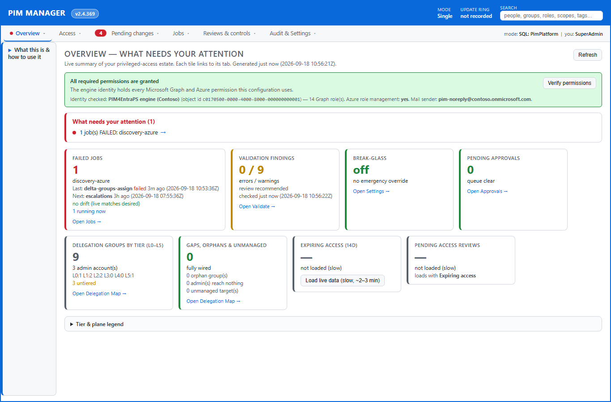
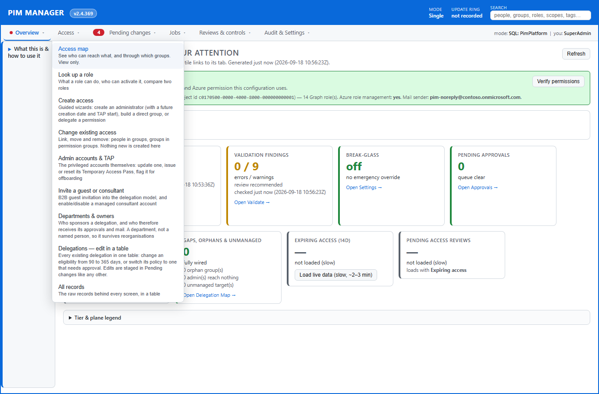
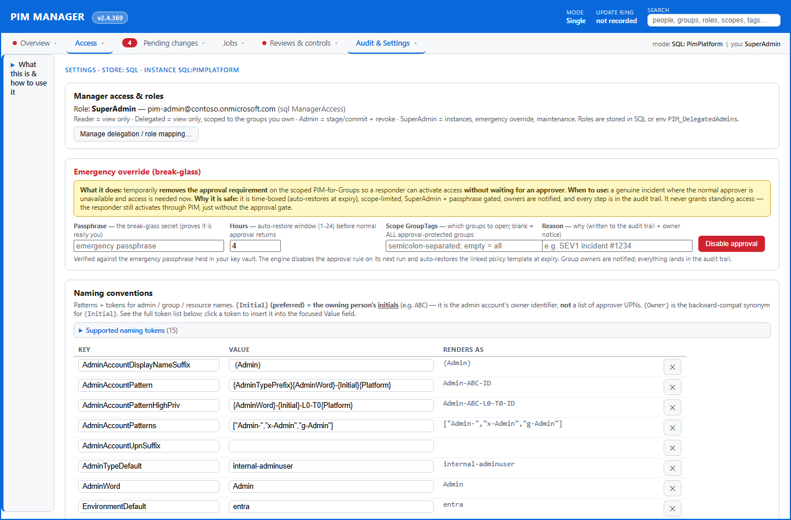
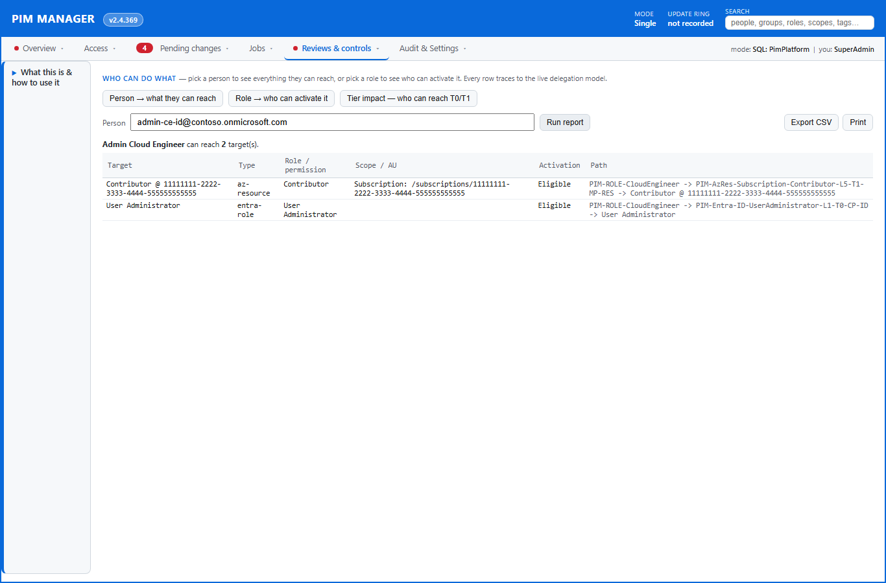
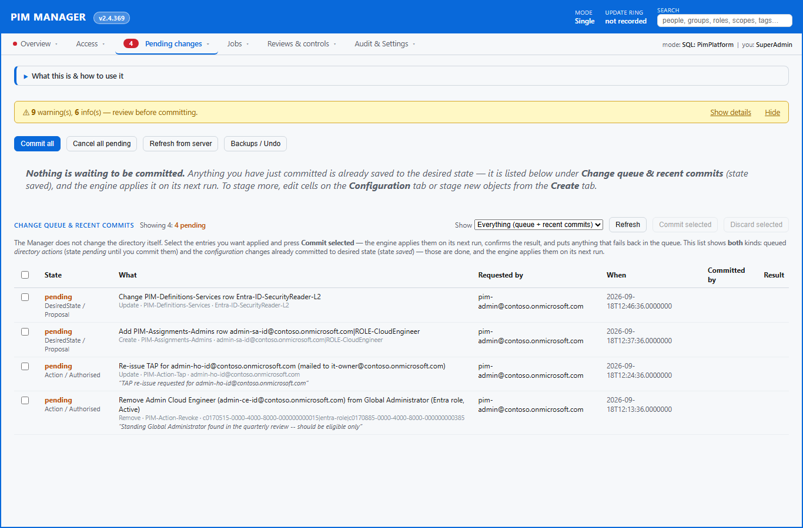
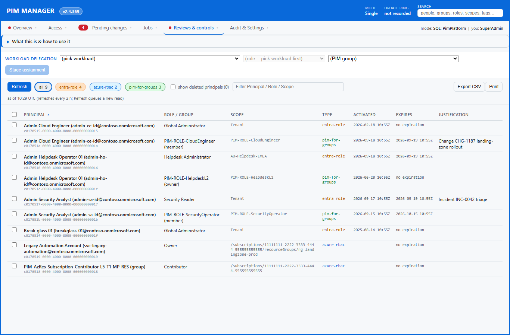
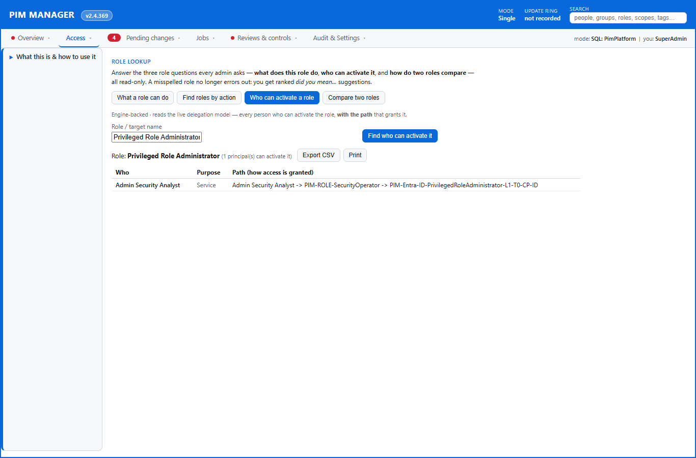
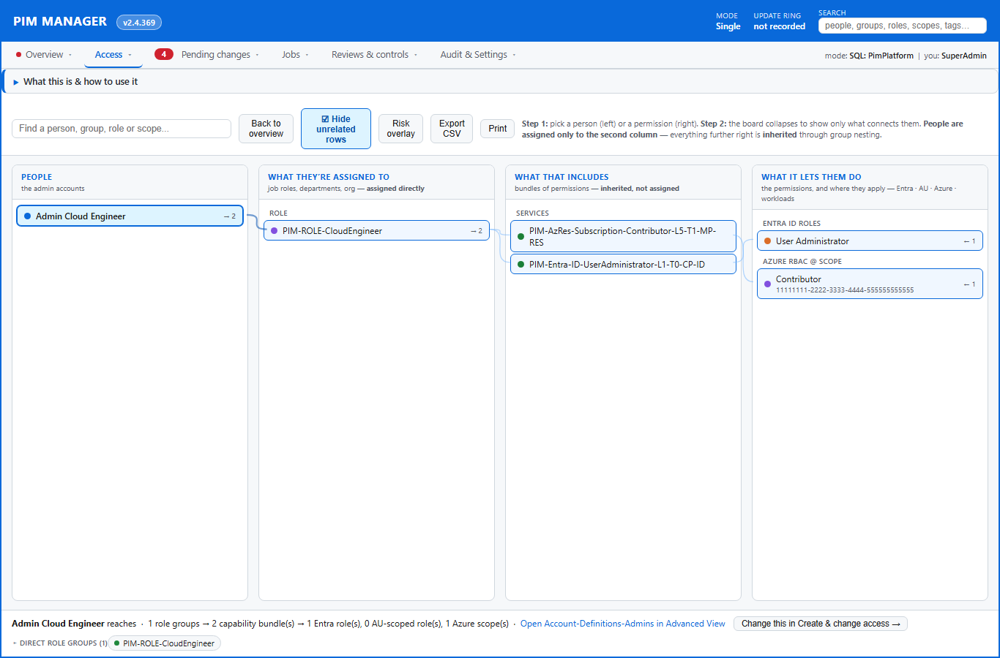
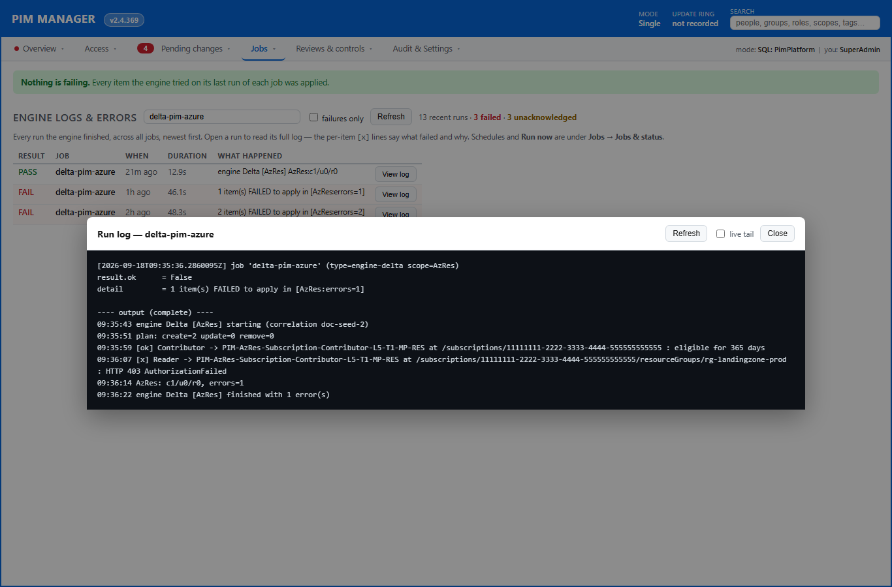
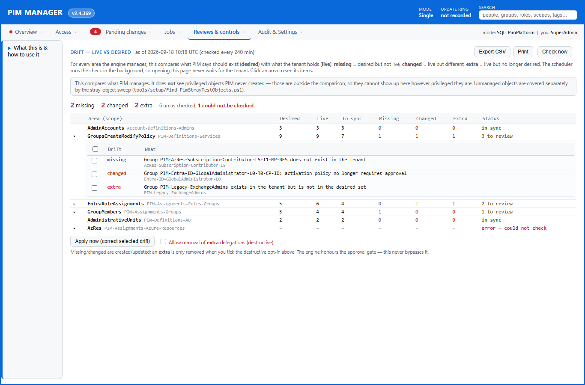

# PIM4EntraPS — delivered feature catalog

This is the delivered feature set of **PIM4EntraPS**, written in plain language for IT
admins and customers. Everything listed here is built and verified. It is grouped by
area and is safe to share publicly. (Last reviewed 2026-09-14; individual entries carry their own ✅ date.)

PIM4EntraPS is a privileged-access governance solution for Microsoft Entra. It models
your privileged delegation as nested groups, applies the right PIM policies, and keeps
everything in sync from a single source of truth — with no unauthenticated endpoint
(every visit to the Manager passes Microsoft Entra sign-in, and a private-only
deployment is a supported choice) and no credentials lying around.

---

## 1. Hosting / Runtime
- **Six supported setups, and you are never locked into the one you start with.** ✅ 2026-09-18
  A deployment is described by who runs it, where the platform runs and where its updates come
  from — and the supported combinations are a fixed, named set rather than something improvised
  per installation:
  - **a single tenant, on our release** — portal, engine and database in that tenant's own
    subscription, updating itself overnight from our release channel;
  - **a single tenant, community edition** — the same shape, free, installed and kept current by
    you from the public repository;
  - **a provider (managing tenant), on our release** — a service provider's own tenant, with the
    provider half on top: define once, sign it, roll it out in waves;
  - **a provider (managing tenant), community edition** — the same, kept current from the public
    repository;
  - **a managed tenant hosted by the provider** — the portal and database run in the provider's
    tenant and govern the customer's directory;
  - **a managed tenant hosted in its own tenant** — the portal and database run in the customer's
    own tenant.

  In every one of them the model being applied lives in **that environment's own database**, and a
  managed tenant always **pulls** — the provider never writes into it. So a tenant can start on its
  own, be taken on by a provider later, and be detached again at any time: detaching removes the
  provider's synced administrators and nothing else, the definitions stay where they are, and the
  environment keeps running exactly as before.
- **Run it where it fits you.** The Manager can run centrally for the whole team, or
  locally on an admin's PC straight against the database — no central web server
  required. A break-glass loopback edition runs on a client PC for the times your
  hosted plan is unavailable, so senior admins are never locked out.
- **Reach the Manager from anywhere, or only from your own network — sign-in is always
  required.** ✅ 2026-09-10 A new hosted deployment makes the Manager reachable over the
  internet behind Microsoft Entra sign-in, so admins can open it without a VPN; building it
  private-only (reachable from your own network only) is a supported choice. Either way
  sign-in is never optional: the installation creates the sign-in registration, switches
  authentication on, reads the setting back, and **stops rather than finishing with an
  unprotected console**. ✅ 2026-09-08
- **Say exactly who may open the Manager.** ✅ 2026-09-09 Signing in only proves someone has
  an account in your organisation. You can name the people or groups allowed in as part of
  the installation: they are assigned first, the assignments are checked, and only then is
  the Manager switched to "assignment required" — in that order, so it can never lock
  everyone out. Leave it out and the installation tells you plainly that anyone in the
  organisation can open it (their role inside the Manager still decides what they can do).

## 2. Containers
- **One image, many roles.** A single configurable engine image runs as manager,
  scheduler, engine, connector, queue worker or discovery job — you simply tell each
  instance which roles to take on. No separate images to build or keep in lock-step.
- **Each worker does only its assigned jobs.** You scope every running worker to the
  job types it should handle, run a single pass on demand, or preview changes without
  applying them.
- **Headless and safe by default.** Containers authenticate using a managed identity —
  no interactive prompts, no secrets baked into the image, and diagnostics that work in
  a fully unattended environment.
- **The web console cannot change your directory by itself.** ✅ 2026-09-12 The Manager's own
  identity holds read-only directory permissions. Everything that changes the tenant — a
  revoke, a Temporary Access Pass re-issue, a sign-in session revoke, a configuration commit —
  is queued and carried out by the engine, which holds the write permissions. A compromised
  browser session or web process therefore cannot write to Entra directly.

## 3. Setup / Deploy
- **One command to stand up — or update — the whole solution.** A single "deploy
  everything" entry brings up (or updates) the entire solution for an environment in the
  right order: it makes sure the engine identity and its permissions exist, stands up the
  hosting (containers or a server host), brings the database schema up to date safely, then
  builds and deploys the latest app — and finally proves the result with an automated
  validation. ✅ 2026-06-16
- **Several environments can update from one automation host, on the same schedule, safely.**
  The daily update can be scheduled to the minute, so environments that share an automation
  host can be spread across an hour instead of all starting together. They also take turns
  automatically: each run claims the shared code directory before it starts, and a run that
  cannot claim it **waits, then skips and says so in its log** rather than building from a
  directory another update is still rewriting. So an update that overruns its slot delays the
  next one instead of corrupting it. ✅ 2026-09-06
- **A warning from a supporting tool no longer looks like a failed update.** Command-line
  tools routinely print advisory notices, and on Windows PowerShell 5.1 those notices could
  abort an update that had already built and published a correct application image. Updates
  now judge each step by its actual result, so only a real error stops a deploy — and when one
  does, the full error text is reported rather than swallowed. ✅ 2026-09-06
- **Safe to run again any time.** The same command is both the installer and the updater:
  anything already in the desired state is skipped, so re-running it only fixes what has
  drifted. A preview ("what would happen") mode is the default, so you always see the plan
  before anything changes.
- **Proves itself, and undoes a bad deploy.** After deploying, it runs a live check of the
  running app plus a tenant validation; if that fails, it automatically rolls the app back
  to the previous known-good version and reports exactly what happened. A validation-only
  mode re-checks an existing environment without changing anything.
- **Repeatable, script-driven setup.** Deployment runs through setup scripts (container,
  VM, and MSP variants) rather than manual clicking, so every environment comes out the
  same way.
- **Database access without passwords.** When using a managed identity against the
  database, setup wires up the correct passwordless access automatically.
- **The installation grants itself database access, and proves it.** ✅ 2026-09-09 A first
  installation no longer leaves the Manager unable to reach its own database. On every
  installation (not only the first) it authorises the environment's network on the database
  server, reads the rule back, and stops with the real start-up error if access still fails.
  A switch covers installations that reach the database over a private connection instead.
- **Support access to the database is declared, not added by hand.** ✅ 2026-09-09 If you want
  a named support identity to be able to work in the database, you name it at install time and
  it receives database rights only — never server administration. Leave it out and no support
  access is granted. Because it is declared, a later re-install keeps it instead of silently
  removing it.
- **Someone can administer the new environment from the first minute.** ✅ 2026-09-10 The
  installation records the senior administrators you name in the Manager's access list in the
  database, so a freshly built environment is never one nobody is allowed to manage.
- **Permissions granted for you.** Setup assigns the engine's identity the exact directory
  permissions it needs, and the Manager's identity a separate read-only set, so both work on
  first run instead of failing on access — and a re-run cannot quietly widen the Manager. A
  refused grant stops the installation and names the permission, instead of producing a
  deployment that looks healthy and cannot work.
- **Notification mail is set up with the narrowest send right.** ✅ 2026-09-13 The installation
  provisions the sender mailbox and gives the environment's identity the right to send from
  that one mailbox only — not from every mailbox in the tenant.
- **Updates arrive through release rings, and an environment updates itself.** ✅ 2026-09-13
  Every hosted environment carries a release ring, and customer environments start on the
  most conservative one. Each night the environment checks which version its ring has
  approved and moves only to that version — never simply to "the newest". ✅ 2026-09-10 It needs
  no build machine: it fetches the approved version's source, builds it in its **own**
  container registry, brings the database up to date **first** (additive changes only, and it
  refuses to move if the schema cannot be verified), rolls **every** component that runs the
  product, verifies the result, and rolls back automatically if verification fails. Each
  nightly run leaves one short status record — from which version, to which, what it did, how
  long it took, any error — so you can see whether one site is stuck or one release is failing
  everywhere. If it cannot read what its ring approves, it stays where it is. Tools run by
  hand obey the same ring and refuse an unapproved version unless an override is given with a
  logged reason. *(The self-updating job needs a published source feed to pull from. A
  community installation from the public repository updates by pulling the new version and
  re-running the same one-command deploy, which is idempotent.)*
- **Updates never go backward by themselves.** ✅ 2026-09-18 Before it builds or rolls anything, the
  nightly update compares the version its ring approves with the highest version the environment is
  known to have reached, and **refuses** to move backward — naming both versions, the ring that
  proposed the older one and the ways out. A target that is not a version number at all is refused the
  same way. A deliberate rollback stays possible, but only when it is explicitly switched on for that
  environment; it is off by default, and a run that uses it says so loudly. Forward updates, the
  "already on that version" no-op and the ring approval itself are unchanged.
- **The update ring you configure is the ring you get.** ✅ 2026-09-18 The ring chosen for an
  installation is carried through to the update job that enforces it; an installation that names no
  ring is told which default it is getting and why; an unreadable ring value stops the installation
  instead of being guessed at; and the installation reads the ring back off the deployed update job and
  fails if it is not the ring that was asked for. A ring nobody verified is a version nobody chose.
- **The Manager shows which update ring this environment is on.** ✅ 2026-09-18 The release ring that
  decides which version an environment may move to used to be visible only to someone who could read the
  update job's configuration. It now appears **beside the mode badge** in the Manager header — marked only
  when it needs attention (behind the version its ring approves, held, or the last update failed) — with an
  **Updates & ring** panel under **Jobs** giving the version running now, the version the ring approves,
  the last update run and the last successful one. Each nightly update records its own run into the
  environment's database, including the runs where it deliberately refused to move, and the Manager reads
  that record: an environment that has not run an update since upgrading shows **"not recorded yet"**
  rather than a guess, and a record older than two days is flagged as stale instead of being shown as
  current. The panel is **read-only by design** — moving a ring stays a deliberate act on the update job,
  and the Manager offers no control that writes one.

## 4. MSP
- **Replication rings — roll a change to one wave of customers before the rest.** ✅ 2026-09-18
  Every definition row carries a ring and every managed tenant carries a ring; a row is admitted
  when its own ring is at or below the tenant's. The ring is never the whole answer: a row reaches
  a tenant only when it is marked for replication **and** the ring admits it **and** the tenant
  matches what the row is aimed at — *ring AND target*, never either-or. Rows are aimed by name or
  by tag: blank means every tenant the ring admits, a named tenant means just that one, several
  tags listed together mean *any of these*, tags joined into one term mean *all of these at once*,
  and a row can be marked as never leaving the provider. Tenant tags live in the provider's own
  tenant record and travel inside the signed set, so a tenant cannot tag itself into scope.
  **A row the ring does not admit is withheld, not retracted** — the tenant does not receive it and
  whatever it already holds is untouched; widening the ring later releases it. Withdrawing access a
  tenant already has is a separate, deliberate act: off by default, reported before it is done, and
  stopped rather than exceeding a safety limit. If a reaching row depends on a row the ring or
  target would have excluded, the dependency is included anyway and the run says so, naming the
  row, what needed it and the tenant. **This is a different control from the release ring that
  decides which software version an environment runs** (chapter 3) — same word, same small
  numbers, not the same scale, and neither one implies the other.
- **See what reaches each tenant, and what is held back, before you send it.** ✅ 2026-09-18 The
  provider's Manager shows per row how many managed tenants it will reach and which ones, and per
  role which tenants it is **withheld** from with the reason — the ring, the target, the
  relationship policy, a capability the customer switched off, or something unresolved. The preview
  builds the real set and runs **the same plan every managed tenant runs**, so it is the decision
  itself rather than a separate estimate. Narrowing a relationship refuses to "let in" a tenant
  that is actually held back by something else, and says which axis is really holding it, instead
  of writing a rule that would change nothing and report success.
- **Pull, never push.** In a managed-service setup, the provider never reaches into or
  writes to your tenant. Each tenant pulls a signed baseline into its own local database;
  your data never leaves your tenant and your local IT keeps full autonomy.
- **Per-tenant isolation.** Each customer has its own data store with no cross-customer
  visibility, while the provider keeps only the central template.
- **One engine image, mirrored into your own registry.** ✅ 2026-06-15 The engine container
  is built once by the provider and **mirrored directly into your own container registry** —
  a server-side registry-to-registry copy, so nothing is rebuilt per customer and no image
  bytes travel through an intermediate host. The image carries **no secrets and no customer
  data** (identity, database and configuration are all supplied locally at run time).
- **Choose the sync model that fits your governance.** ✅ 2026-06-15 You are not forced into a
  single managed-service shape. Pick how the central template reaches your tenant — pull a
  signed baseline, pull a versioned template by rollout ring, read the central template
  read-only at run time, emit a signed status summary back to the provider, or run fully
  autonomously with the provider delegating to your local IT. **Every** option is initiated
  by your own tenant (pull, never push), and the platform refuses any configuration that
  would let the provider write into your tenant or let your data leave it.
- **Signed baseline with an instant kill-switch.** ✅ 2026-06-15 The baseline you receive is
  cryptographically signed; your environment verifies the signature before applying anything,
  so a tampered or forged baseline is rejected. If a signing key is ever compromised, it is
  removed from the keys your tenant trusts and your environment refuses anything signed by it
  from the next pull. A separately **signed central-kill instruction** lets an authorized owner disable or
  revoke a specific privileged account across every managed tenant at once — applied locally
  by your own engine through the same audited, authorized path as any other change (never a
  back-door write from outside).
- **Each admin says whether it is synced to managed tenants, and to which.** ✅ 2026-09-13 On
  the managing (master) tenant, an admin is synced to managed tenants only when its own record
  is marked as MSP-managed, optionally narrowed to tenants carrying particular tags; every other
  admin stays local. Managed tenants keep their own local admins separately, and a synced admin
  is governed by the master — including its status and its auto-disable date, which flow down with
  it. Admins that are not synced are reported with the reason.
- **A permission delegation can be given its own activation policy.** ✅ 2026-09-16 When you create a
  permission group — for Entra ID or for an Azure resource — you choose the activation policy it uses,
  including one that makes activation need **approval**. The choices are the policy templates *your
  tenant* has, including any you added or edited yourself, and each is labelled with what it does.
  **"Use default" is the first choice and changes nothing**, so a group created without touching the
  field behaves exactly as before.
- **The delegation table is in the menu, under the name of the job.** ✅ 2026-09-16 Access → *Delegations
  — edit in a table* opens every existing delegation in one table, so changing an eligibility from 90 to
  365 days, or switching a delegation to a policy that needs approval, is a couple of clicks. Edits queue
  in Pending changes and commit like any other change. *All records* remains as the raw view of
  everything, and the narrowed table says it is narrowed with one click back.
- **Mail about an administrator goes to their sponsor department's owners.** ✅ 2026-09-16 When PIM sends
  anything about an administrator account — the new-account notice, the Temporary Access Pass — it goes to
  the **owners of the department that sponsors that administrator**, all of them, not to a manager recorded
  on the person. Departments outlive reorganisations and people do not, so the mail keeps arriving when
  somebody changes job. Two deliberate exceptions: an administrator may carry an explicit forwarding
  address, which always wins because it is a decision written on that record; and a manager address on an
  older record still works so existing data keeps running, but it is reported as legacy everywhere it is
  used, so you can move it to the department. If none of those resolves, PIM **refuses to send** and tells
  you exactly what to set — the administrator's department, or that department's owners — rather than
  quietly mailing nobody.
- **Each admin's sponsor department is on the Admin accounts screen.** ✅ 2026-09-16 The department that
  sponsors an administrator is what decides who approves for them and where their mail — including
  their Temporary Access Pass — is delivered. It now has its own column, with the department's owners
  shown on hover, so you can see the whole sponsor chain from the list. Two gaps are called out
  separately because they are fixed in different places: an administrator with **no department** (fix
  the administrator) and a department with **no owners** (fix the department). If the owner list could
  not be read at all, the column says *owners not checked* rather than claiming there are none.
- **PIM never deletes an account, and never disables one just for being missing.** ✅ 2026-09-16
  Two things the product deliberately will not do, on any tenant: it **never deletes a user
  account** — offboarding disables the account, revokes its sessions and removes its privileged
  access, and the account then stays in your directory, disabled, until a person removes it by
  hand; and it **never disables an account merely because it is absent from your definitions** — a
  live administrator account you have not defined is **reported** in every run so you can see it,
  and switching it off is your decision, made on its record. The date that switches an account off
  is called **Auto-disable date**, it is shown and editable on the Admin accounts screen, and it
  does exactly what its name says.
- **You can always see which mode a tenant runs in.** ✅ 2026-09-13 The Manager header shows the
  tenant's mode (for example single tenant, managing tenant, or managed tenant), so nobody has
  to guess whether a change made here is local or arrives from a managing tenant.
- **The provider publishes the baseline from its own cloud environment.** ✅ 2026-09-17 A
  scheduled job in the provider's environment builds and signs the baseline every day (and on demand)
  with a signing key that never leaves the provider's key vault. It runs as its own managed identity
  with no certificate, secret or storage key, checks the signature before it uploads and reads the
  published baseline back the way your tenant will before it reports success. No management server or
  scheduled task is involved.
- **Your tenant decides which provider key it trusts.** ✅ 2026-09-17 You configure the
  identifier of the provider's signing key once; a baseline signed by any other key is refused before
  anything is applied. Several keys can be trusted at the same time, so the provider can change keys
  without interrupting you, and you stop trusting a key by removing it from your configuration.
- **No expiring links, no shared credentials.** ✅ 2026-09-17 Your tenant reads the provider's
  signed baseline over the network: through a private endpoint when your private network is connected
  to the provider's (no public access to the file at all), or, when it is not, as an anonymous read of
  that one file from the networks the provider names. The signature — not the network — is what you
  rely on, and nothing in that path expires.
- **A fully private deployment on both sides.** ✅ 2026-09-17 Provider and managed tenant can each
  run with no public entry point at all: a network-internal application environment, a baseline store
  reachable only through a private endpoint, and a database that admits only that environment. Each
  side publishes the name it reaches the other by in its own private DNS, so neither side needs rights
  in the other's network. During a build the deploying machine gets a time-boxed database window that
  is closed again when the build finishes.
- **Deploy with your own administrator sign-in.** ✅ 2026-09-17 Both the provider and a managed
  tenant can be built with one command while signed in as an administrator, without creating a
  deployment application or certificate first. The build confirms it is running as a person in the
  intended tenant and subscription before it changes anything.
- **The baseline banner says why a baseline is not verified.** ✅ 2026-09-17 The Manager's
  managed-service view names the key that signed the baseline and, when the baseline is not verified,
  the reason — an untrusted key reads differently from a tampered or expired one — instead of a bare
  "not verified".
- **One shared platform for related tools.** ✅ 2026-06-15 The tenant/application registry is
  shared and **keyed by product**, so companion tooling (such as tenant management) reuses the
  exact same registry, authentication and storage model rather than a separate parallel
  system — fewer moving parts, one consistent security posture.

## 5. SQL / Data
- **Single source of truth in SQL.** ✅ 2026-09-13 Configuration, settings, access rules,
  delegation profiles, policy templates, mail templates, the audit trail, scheduler state and
  tenant caches all live in the database — no scattered configuration files or shares to keep in
  sync, and nothing of that lost when a container is replaced. The Manager requires
  the database to start and never falls back to reading files.
- **Passwordless database auth.** Cloud databases use Entra/managed-identity authentication
  only (no SQL logins or stored passwords); on-prem uses integrated Windows auth.
- **One consistent data path for the app.** The Manager reads and writes through a single
  database-aware layer, shows you which database you're connected to, and lets you switch
  between databases from a dropdown.
- **Run against a local database with zero extra setup (development).** ✅ 2026-06-14 For
  development and management-server inner-loop work, the engine can read its desired
  configuration from a **local database** using the signed-in machine identity — no cloud
  connection, no separate database login, no token juggling; just point the engine at the
  local instance and run. (The single authoritative store in production — and for break-glass
  — is always the cloud database; the local instance is a developer convenience.)
- **Moving from the file-based edition is a one-time import.** ✅ 2026-09-13 An existing
  installation that kept its configuration in files is brought into the database once, by an
  import you run during migration. It reads your files **read-only** (they are never modified
  or written back), brings each row up to the current shape on the way in, and writes each
  file's rows inside a single transaction — a file that fails is rolled back whole, named, and
  makes the import end as a failure rather than "complete". It also carries over the runtime
  state the old edition kept beside its configuration (alerts, scheduler state, exemptions,
  audit history and customised mail templates). Re-running it is safe. After the import the database is the only store.
- **Changes recompute on their own.** ✅ 2026-06-14 When the configuration in the database
  changes — from the Manager, from another management node, or edited directly — the platform
  notices and **automatically schedules a recalculation** so the live environment reconciles to
  the new desired state without anyone kicking off a run.
- **Always-on database + resilient health checks.** ✅ 2026-06-14 The hosted database is
  configured to **stay awake** (no auto-pause), so neither the health probe nor the first
  request after an idle period suffers a cold start. The health endpoint **tolerates a brief
  database hiccup** (a single blip is reported as a transient warning but the service stays up)
  and only reports unhealthy on a **sustained** outage.

## 6. Engine — Core
- **Modern, dependency-free engine.** The engine talks directly to Microsoft's APIs and
  the database — no heavy PowerShell modules to install or keep updated — so it runs on a
  plain VM or in a lightweight container.
- **Fast incremental runs.** Instead of a one-to-two-hour full sweep every time, the
  engine queues changes and applies only what actually changed, scoped to the area you
  ask for. Full reprocessing is still available when you want it.
- **A change runs only the engine steps its data needs.** ✅ 2026-09-14 When you commit a change,
  the platform works out which kind of data changed and runs only the engine steps that read it —
  for example an Azure role delegation runs the Azure policy and Azure assignment steps, not
  every step for the whole tenant. A kind of data the platform does not recognise still runs
  everything, so a gap can cost time but never a missed change. (The first change after an
  update runs every step once, because there is nothing yet to compare against.)
- **Changes start moving right away.** ✅ 2026-09-14 A commit, a queue commit or **Run now** can
  start the scheduled engine job immediately instead of waiting for its next start — where the
  Manager's identity has been allowed to start that job. Without that permission the change
  runs on the next scheduled start (within about five minutes), and the Manager says so. A run
  that is already in progress picks new commits and queued work up as soon as its current job
  finishes, instead of waiting for the whole run.
- **Queued actions do not wait for a long run.** ✅ 2026-09-14 A committed queued action — such as
  a Temporary Access Pass re-issue or a sign-in session revoke — is applied **between the engine's
  steps**,
  so it lands within minutes even while a long reconcile is working through the tenant.
- **Engine errors name what they are about.** ✅ 2026-09-13 A failing item reads like "group
  PIM-X → Azure role 'Reader' at management group Y (Active)" or "PIM policy for Azure role
  'Reader' at management group X (template Y)", with a link to that scope's PIM settings in the
  Azure portal — never an empty group or an object id. A group that simply has not been created
  yet is reported as such, and a refused permission is reported as a missing permission, naming
  it, instead of "not found".
- **Sets everything up for you.** From one run the engine creates the groups, delegations,
  org-group access, time-limited access passes, admin schedules and notification emails —
  nothing has to be wired up by hand.
- **Clear, readable logs.** Every action is logged on one tagged line (assign / update /
  extend / remove / OK), errors name the actual resource or role instead of an opaque ID,
  and a full transcript is kept for each run.
- **Stricter policy for the most privileged roles.** ✅ 2026-06-14 Global-Administrator-style
  delegation is automatically configured to **require approval at activation** (verified live
  against a real PIM-for-Groups policy). The approver is resolved the same way ownership is —
  from the group's owners, sponsor, or its department contact — so a high-privilege group is
  never left requiring approval with nobody able to grant it.
- **Safe by default — reconciliation never deletes silently.** ✅ 2026-06-14 A normal run only
  creates and updates. Removing live access that isn't in your configuration is a separate,
  explicit opt-in, and the engine will refuse to "prune" an area whose desired set is empty —
  so a partial or half-loaded configuration can never wipe out real administrators.

## 7. Engine — Providers / Connectors
- **Map one PIM group to many workloads.** Connectors translate your PIM groups into the
  right access across Entra roles, Azure RBAC, Power BI / Fabric, gallery enterprise apps
  (such as SAP or ServiceNow), and Dataverse / Dynamics 365 — each connector turns on its
  own access prerequisite.
- **Defender XDR & Intune access from the same PIM groups.** ✅ 2026-06-14 — give a PIM group
  a Microsoft Defender XDR (Unified RBAC) security role, or an Intune (device-management) role
  optionally limited to specific Intune scope tags, exactly the way you grant Entra and Azure
  roles. Admins get the workload access by being a member of the group; assignments are
  matched by what already exists (so re-running never duplicates them), and the engine only
  reads at collection time — it makes changes solely when applying your desired configuration,
  and only removes a role you no longer want when you explicitly ask it to prune.
- **Any enterprise app, one connector.** ✅ 2026-06-16 — grant a PIM group an app role in *any*
  enterprise application — gallery apps (SAP, ServiceNow, Salesforce, …) or your own
  line-of-business apps — with a single generic pattern, so you don't need a separate connector
  per app. Name the target app (by its display name, application id, or service-principal id)
  and the app role you want (by the role's name, or leave it blank for the app's default
  access); the engine looks up the role on the app and assigns your group to it. Like every
  other connector it matches what already exists (re-running never creates a duplicate),
  reads-only at collection time, and removes an app-role grant only when you explicitly prune.
  If you name an app role the app doesn't expose, it fails clearly instead of guessing.
- **A group's activation policy is fully managed and self-correcting.** ✅ 2026-06-16 — the
  engine doesn't just set a PIM group's activation policy once; it keeps the whole policy in
  line with the template you chose — how long an activation lasts, whether multi-factor and a
  justification are required, whether activation needs approval (and who approves), and who is
  notified. On every run it reads the group's current policy back and compares the *entire* rule
  set: if nothing has drifted it changes nothing (re-running is safe and silent), and if anyone
  has altered a setting in the portal it puts it back to your intended policy. Adding or removing
  an approver is detected and corrected too. Existing settings the engine doesn't manage are left
  untouched.
- **Azure resource role policies are managed too.** ✅ 2026-09-13 The settings on Azure roles —
  maximum activation and assignment durations, MFA and justification on activation,
  notifications, and approval where the template asks for it — follow your policy templates,
  exactly as for Entra roles and PIM for Groups. A policy that was only partly configured is
  repaired rule by rule, and approval that is already switched on is never removed.
- **Group owner policies and the full notification set.** ✅ 2026-09-13 The owner-role policy on
  each PIM group is managed as well as the member policy, the complete set of notification
  settings is applied, and every directory role and managed group is checked — not only the ones
  named in your data.
- **Moving from v1 changes no PIM policy.** ✅ 2026-09-13 The standard policy templates for Entra
  roles, Azure resource roles and PIM for Groups (member and owner) carry exactly the values v1
  used, and a standing check compares every rule with v1's definitions so they cannot drift
  apart. Templates stored before an update receive new settings automatically, without
  overwriting anything you changed.
- **A safety brake on large or weakening policy changes.** ✅ 2026-09-13 If a run would change
  many PIM policies at once, or weaken protection (for example remove MFA on activation),
  **nothing is changed**: the plan is held and shown for an administrator to approve on the Jobs
  page, and the approval covers exactly that plan and nothing else. The brake covers Entra role,
  Azure resource and PIM for Groups policies in every case. Ordinary drift is still corrected
  straight away, and applying a template to a brand-new group's untouched default policy is not
  treated as weakening, so creating new delegations does not trip it.
- **Only the rules that differ are updated.** ✅ 2026-09-13 A PIM for Groups policy that differs
  on one rule is updated with one change instead of rewriting every rule (Azure resource policies
  are likewise repaired rule by rule), which makes large policy alignments many times faster and
  leaves the rules that were already right untouched.
- **Full set of building blocks.** The engine covers administrative units, groups and group
  owners, admins and their time-limited access passes, Entra roles and role-scoped
  administrative units, group and admin membership, Azure resources, group policies and
  access reviews — all through direct API calls.
- **Import roles, don't type them.** The Manager reads the live list of available roles for
  a service so you pick from real roles instead of risking typos, diffs them against what
  you already have, and lets a super-admin confirm before importing.

## 8. Discovery
- **New Power BI workspaces become ready-to-delegate access groups.** As workspaces appear,
  the solution proposes a correctly-named, tier- and plane-classified access group for each
  one — so a new workspace is delegable minutes after it exists, with the same naming and
  structure as everything else.
- **Renames are tracked, not duplicated.** A workspace, subscription or management group that
  is renamed or moved is matched by its stable identity and the existing access group is
  renamed in place — you never end up with an orphan plus a duplicate.
- **Propose, never auto-assign.** Discovery creates the empty access-group container for a new
  resource (when you opt in to auto-import) but never grants anyone access automatically —
  who gets in stays a human decision. Anything without an auto-import rule is simply listed
  for review.
- **New built-in roles are catalogued automatically.** When a service (Entra, Defender,
  Intune) gains a new built-in role, it is added to the catalog so you can pick it — and an
  already-catalogued role never shows up again as "new".
- **You only ever see what's new.** Each discovery run surfaces only the items you haven't
  handled yet; once an item is acted on it stops reappearing, so the review list stays short.
- **Discovery runs on its own schedule — and only ever shows you what's new.** ✅ 2026-06-17 — the
  solution can scan for new Azure scopes (subscriptions and management groups) and new Power BI
  workspaces on a regular cadence, entirely in the background, so a freshly-created resource becomes
  ready to delegate without anyone remembering to run a scan. Each scheduled pass is careful in three
  ways. It **remembers what it has already surfaced**, so an item you've already seen never reappears
  on the next run — the review list stays short and only genuinely-new resources show up. It is
  **safe by design**: a scheduled run can only ever *propose* — it creates an empty, correctly-named
  access-group container for a new resource where you've opted into auto-import, and it renames an
  existing container in place when a resource is renamed (matched by stable identity, so you never get
  an orphan plus a duplicate). It **never deletes**: a resource that has disappeared is surfaced for
  you to look at, but a scheduled run will never remove access on its own — destructive cleanup stays
  a deliberate, human decision. Everything a scheduled pass decides to do is staged onto the normal
  change pipeline (the same one your reviewed commits use), so nothing is granted without going through
  your usual review and approval. A preview ("what would this find") mode reports without changing
  anything.

- **Import your departments straight from Entra.** ✅ 2026-06-15 — point the solution at a group
  naming convention (for example `ORG-*`) and one click pulls every matching Entra group in as a
  department for approval routing, with each group's owners brought along as the people who
  approve for that department. Re-import any time: existing imported departments are refreshed in
  place, nothing is duplicated, and any department you added by hand is left untouched. You set
  and confirm the pattern right in Settings before importing.

## 9. Auth / Identity
- **An admin whose first-time sign-in pass has expired is rescued automatically.** New admin
  accounts are handed a time-boxed Temporary Access Pass so they can sign in and register their
  own MFA. If nobody uses it before it expires, that admin previously had **no way back in at
  all** — and the system reported everything as healthy, because it only checked whether a pass
  existed, not whether it still worked. It now checks that the pass is genuinely **usable**, and
  issues a fresh one to any admin whose pass has lapsed. *(✅ 2026-08-21, verified against a live
  tenant.)*
  - **It refuses to issue a pass it cannot deliver.** If the notification mailbox is not set up,
    the recipient address is missing, or email is switched off, the system **changes nothing** and
    says why. A sign-in credential that was created but never reached anyone is worse than the
    expired one it replaced — so it will not create one it cannot hand over. If a pass is issued
    and the email then fails anyway, that is now reported loudly rather than passing silently.
  - **It never issues in a loop.** Once an admin holds a working pass the system leaves it alone;
    and if it cannot read an admin's current state, it deliberately does nothing rather than risk
    issuing a new credential on every cycle.
  - **The code only ever appears in the email** — never in a web response, on screen, or in an
    audit record. Passes can also be re-issued on demand from the Manager by an administrator; the
    re-issue is queued, applied by the engine, and mailed to the account owner's address (below).
    If that mail cannot be delivered, the existing pass is left untouched.
- **Admin mail goes to the person behind the admin account.** ✅ 2026-09-12 An admin account
  usually has no mailbox of its own, so mail about it — the welcome mail and its Temporary
  Access Pass — goes to the account owner's everyday office address: the forwarding address
  recorded on the account when forwarding is switched on, otherwise the manager address. The
  admin screen shows exactly which address a mail will go to, and a value that is not a real
  email address is refused rather than used — with no valid address, nothing is issued.
- **Mail is sent as the environment's own identity, from one mailbox only.** ✅ 2026-09-13 A hosted
  environment sends notification mail as its managed identity, with the right to send limited to
  the configured sender mailbox. No tenant-wide send permission is granted, and a refused send
  names the identity and the exact grant that is missing.
- **Every cloud admin gets a Temporary Access Pass, on time.** ✅ 2026-09-13 A pass is issued to
  every cloud admin account (on-premises AD admins cannot hold one), respects the start date you
  set, is issued once, and follows your tenant's own pass policy (for example one-time use).
- **100% direct API, no modules.** Authentication runs entirely over REST, so the solution
  works on a clean VM or container with nothing pre-installed.
- **Managed identity or certificate, not shared secrets.** A hosted environment runs the engine
  and the Manager as the containers' own managed identities, so there is no credential to store or
  rotate. An engine that runs on a server signs in as an application with a certificate from the
  machine certificate store. A client secret is accepted only where a platform requires one — for
  example the Manager's sign-in registration — and grants sign-in only.
- **No secrets in configuration.** Access uses a managed identity or a Key Vault pointer;
  settings live in the database and seed files never carry secrets.
- **Tells you exactly which permission is missing.** When a call is refused for lack of
  permission, the tool no longer stops at a bare "access denied" — it names the precise
  permission to grant (for the automation identity) or the privileged role you need to
  activate (when you are signed in as yourself), and points at the one script that grants
  it. No more guessing which consent is missing. *(✅ 2026-06-14)* The same "name the exact
  fix" guidance now also covers **Azure resource (RBAC) refusals** — an Azure
  "AuthorizationFailed" is recognised as a missing **Azure role at the scope** (not a
  directory consent), so the hint says to grant or activate the right Azure role on the
  subscription / management group rather than pointing you at the wrong place — and the
  newer workload connectors (Microsoft Defender XDR, Intune, and granting a group an app
  role in any enterprise application) each name their own exact permission too. *(✅ 2026-06-17)*
- **Tells you what to activate BEFORE you act — not after a failure.** When you are signed
  in as yourself and start a privileged change (for example configuring a PIM policy,
  managing an administrative unit, or assigning an app role), the tool checks up front
  whether the directory role that action needs is **currently active** for you. If it is
  only *eligible* and not yet activated, you get a clear "activate this role in PIM first"
  prompt **before** the change is attempted — so you activate once and proceed, instead of
  driving all the way to an "access denied" and then starting over. If the right role is
  already active you are never interrupted, and an emergency super-admin path is never
  blocked. *(✅ 2026-06-17)*
- **Always shows the account picker — never reuses a stale login silently.** Interactive
  sign-in always lets you confirm which account you are using, and forces a fresh sign-in
  when the cached account is not the one you expected, so you can't accidentally act as the
  wrong identity. *(✅ 2026-06-14)*
- **Explains on-prem AD failures instead of hiding them.** If an Active Directory action
  fails, the tool reports *why* — the identity it actually ran as, whether it had a domain
  logon and Kerberos tickets, and whether a domain controller was reachable — so you know
  whether to fix the credential, the network/DNS, or the target object's rights. *(✅ 2026-06-14)*
- **MFA-gated admin console (optional).** The privileged Manager console can require a fresh
  multi-factor sign-in before it opens, so a copied script can't be replayed without you
  passing MFA. When the console runs centrally behind Entra sign-in, that gateway already
  enforces MFA, so the local gate stays out of the way. *(✅ 2026-06-14)*

## 10. Delegation model
- **Two-tier group nesting at the core.** Admins are added to direct groups (by role, task,
  process, cross-org or department) which nest into permission groups that hold the actual
  roles and scopes. This delivers least-privilege access across many apps by reusing group
  nesting and RBAC — and it's the heart of the model.
- **Nesting into a role-assignable group is always Eligible — and old Active nestings are one click
  from fixed.** ✅ 2026-09-13 Microsoft Entra refuses an *Active* membership of a group inside a
  role-assignable group, so such a delegation could never reach the tenant. Every wizard now writes
  that kind of nesting as **Eligible**, whatever else is chosen, and a delegation made Eligible is
  written Eligible everywhere. An existing Active nesting of that kind is reported by validation as
  an error with a one-click **Set to Eligible** fix (staged to Pending changes for you to commit),
  and the engine lists it under Engine logs & errors instead of skipping it silently.
- **Direct groups by type, including projects and cross-organisation teams.** ✅ 2026-09-12 A new
  direct group asks what it is — role, organisation, department, process, project or cross-org —
  and is stored with the other groups of that type; department and process groups are created by
  the engine like every other group, and the wizard adds the group type's administrative unit when
  it is missing.
- **Everything is a group.** The thing you grant is always a group; administrative units
  and Azure scopes are only the *where*, never the *who*. Delegation is simply group
  membership.
- **Every group has an owner — automatically.** Groups are never created without an owner;
  the owner is resolved from the assignment, the sponsor, or the department-to-owner
  mapping.
- **Scoped portal admins.** A delegated/portal admin profile carries the services, tier and
  level ceilings, scopes and the set of admins they may manage. A workload owner sees only
  the groups they own, and even the admin list is filtered so they cannot see the most
  privileged tiers. Super-admins bypass the scoping.
- **Invite an external consultant straight into the delegation model.** ✅ 2026-06-15 Bring an
  external consultant in as a cloud guest and place them into a delegation group in one step:
  the solution prepares the guest invitation and, at the same time, the consultant's admin record
  and their membership in the chosen delegation group — all staged for the normal Review & Save
  flow, so nothing is granted until you confirm and the engine applies it. Guest invitation is
  cloud-only (you cannot invite a guest into on-prem Active Directory), and only an operator with
  the guest-invite delegation right (or a super-admin) may do it.
- **Self-service consultant enable / disable.** ✅ 2026-06-15 A department or service owner can
  switch one of *their own* managed consultants on or off from the console — without a central
  request. The action is allowed only for the consultants that owner manages (a super-admin may
  toggle any), and it is queued as a normal account change that the engine applies, so it is
  audited and reversible like everything else.
- **Local self-service delegation — no central request needed.** ✅ 2026-06-14 When you run
  the solution for your own organisation, your local IT can self-delegate any permission,
  including the most privileged, without raising a request to a managed-service provider —
  full local autonomy. In a managed-service setup that self-grant path is closed instead, and
  an organisation can additionally pin specific privileged groups as "enforced" so they can
  never be locally overridden. Super-admins are never locked out, and a self-delegation is
  recorded as an ordinary assignment so it is audited and offboarded like any other.
- **Two clearly separated approvals — one yours, one the platform's.** ✅ 2026-06-14 *Delegation
  approval* (who may be added to a group) is handled by the solution: it can route to a
  department — automatically resolving the department to its responsible people — and it
  layers and escalates as a request ages. *Activation approval* (approving an activation in
  the moment) is handled natively by Microsoft Entra PIM. Because Entra only accepts named
  people as approvers, the solution automatically turns any department or role persona into
  the actual people before it configures the policy, and refuses to publish an approval rule
  that would end up with nobody to approve. The two are never confused, and the solution never
  sends activation emails — Entra does that.
- **Reachability by classification — privileged-workstation aware, opt-in.** ✅ 2026-06-14
  (opt-in default OFF ✅ 2026-06-15) Each delegation can carry a network-reach classification
  derived from its tier, plane and level — for example the most privileged tier is confined to
  the privileged-workstation (PAW) segment, the management plane is limited, and broad workload
  roles reach the whole corporate network. **Privileged-workstation detection is opt-in and OFF
  by default**: out of the box nothing is confined to a PAW segment (so a tenant that does not
  run privileged workstations is never blocked), and you turn it on with a single setting when
  your environment is ready for it. The classification is fully configurable to match your own
  segmentation, and emergency super-admin access is never locked out.

## 11. GUI / Manager

*The Manager opens on Home: red/amber/green attention tiles for engine health, validation findings, break-glass, delegation by tier, gaps, expiring access and pending reviews. (Synthetic demo data.)*

- **Turn any Manager feature on or off in Settings — roll out gradually.** ✅ 2026-06-16 — every
  screen in the Manager (each tab and major panel) can be switched on or off from a **Features** panel in
  **Settings**, so you can introduce capabilities to your team **one at a time** rather than all at once.
  Turn a feature off and its tab simply disappears from the menu on the next page reload; turn it back on
  when you're ready and it returns. Core, everyday screens are on out of the box; newer or more advanced
  screens start off so you can enable them deliberately as you adopt them. A few essential screens (**Home**,
  **Audit**, and **Settings** itself) are always on, so you can never accidentally hide the way back in.
  Changing the feature set is restricted to a senior administrator and every change is recorded in the audit
  trail. Because the on/off choices are saved in the same place the rest of the Manager reads, what you see
  in the menu always matches what's actually enabled.
- **Six menus named after what you came to do.** ✅ 2026-06-16, reorganised ✅ 2026-09-14 — the
  Manager's screens sit under **six top-level menus** so a security leader or a first-time admin can
  find anything in seconds:
  - **Overview** — the Home dashboard.
  - **Access** — the Access map, role look-up, create access, change existing access, admin accounts
    and Temporary Access Passes, guest/consultant invitations, departments & owners, and all records.
  - **Pending changes** — check for problems, and the one review-and-commit queue.
  - **Jobs** — jobs & status, **Engine logs & errors**, and the **Job schedule**.
  - **Reviews & controls** — review standing access, approvals, **Drift: live vs desired**, access
    reviews, tenant conformance, reports and managed tenants.
  - **Audit & Settings** — the audit trail, Settings, **Newly discovered resources**, and direct links
    to the Settings sections for Manager access & roles, the emergency override (break-glass) and mail
    templates, plus Support.

  Every entry says in one line what the screen does, and each menu carries an attention dot and
  per-item count, so what needs action is visible without opening every screen. The former Daily
  operations menu is folded into Reviews & controls; permission template packs and mail templates are
  sections in Settings.

  
  *The six top-level menus, each entry described in one line and carrying an attention count. (Synthetic demo data.)*

- **In-context guidance + consistent panel states on every screen.** ✅ 2026-06-17 — every screen now
  carries a short, collapsible **"what this is & how to use it"** banner at the top, so a first-time admin
  always knows what a tab is for and the next step to take — no guessing. Across the whole Manager the
  **loading, empty and error** moments look and read the same: a screen is never left blank, an "empty"
  result says so in plain language (rather than showing nothing), and a problem is shown as a tidy,
  readable message instead of a raw technical error. Screens that talk in terms of privilege **tiers and
  planes** (the delegation map, role lookup and reports) include the same plain-language **tier / plane
  legend** inline, so the vocabulary is explained right where it's used. The guidance can be collapsed once
  you know your way around, and it's a presentation layer only — it changes nothing about how the Manager
  behaves.
- **Home / Overview — "what needs my attention" at a glance.** ✅ 2026-06-15 — the Manager now
  opens on a **Home** dashboard instead of dropping you straight into the map. It summarises the
  health of your privileged-access estate in clear red/amber/green tiles, each of which you can
  click to jump to the tab that owns the detail:
  - **Failed jobs / engine health** — how many background jobs failed, what's running now, when the
    last run was and whether it succeeded, and when the next run is due (so an overnight failure is
    visible the moment you log in, not buried).
  - **Validation findings** — the current count of blocking errors and warnings from the pre-flight
    checks.
  - **Break-glass** — whether an emergency override is active right now, who activated it, and when
    it expires.
  - **Delegation by tier (L0–L5)** — how your delegation groups are spread across privilege levels.
  - **Gaps, orphans & unmanaged** — groups that reach nothing, admins who reach nothing, and
    targets no group manages.
  - **Expiring access (next 14 days)** and **pending access reviews** — what needs renewing,
    revoking or deciding soon. ✅ 2026-09-13 Expiring access opens instantly from the scheduler's
    active-assignments snapshot and shows when that snapshot was taken; pending access reviews, which
    are still read live, load only when an admin asks for them — so opening Home never slows the
    Manager down for anyone else.
  Every tile is backed by real engine/job/validation/audit data with an honest empty state — there
  are no decorative or dead tiles. A red badge on the Home tab shows the total number of items
  needing attention.
- **A missing engine permission is impossible to miss.** ✅ 2026-09-13 When the scheduled engine is
  refused a permission, the permission banner on Home turns **red** and names what was refused — it
  checks the engine's identity, not only the Manager's own.
- **Alerting — get told when something goes wrong.** ✅ 2026-06-15 — choose who is emailed and
  which events raise an alert (an **engine/job run failure**, **configuration drift**, **access
  expiring soon**, or **break-glass use**) from the Home/Settings **Alerting** panel. Alerts are
  delivered through the same notification path as every other PIM email. If no sender mailbox is
  configured yet, the panel says so plainly ("configure to enable") and prepares the alert without
  sending — it never silently drops or fakes a notification. A **Send test alert** button confirms
  the wiring end-to-end.
- **Alerts you can trust — a feed of what was pushed out, with proof of delivery.** ✅ 2026-06-17 —
  alerting now keeps a durable **Recent alerts** feed: every alert that fired is recorded with **when**
  it fired, **which event** it was, **who was notified**, and whether it was actually **delivered** or
  only **prepared** (when no sender mailbox is configured yet). This turns a claim like "the owners were
  notified when break-glass was used" into something you can **verify** — the feed is the proof. Two
  more refinements ship with it: **access expiring soon** now actually raises an alert when the Manager
  finds time-bound access about to lapse (previously it was an option you could tick but nothing fired
  it), and a **debounce** stops the same recurring condition (for example, the same drift on every run)
  from emailing you over and over — you get told once, not on a loop. The feed appears on the Home/Settings
  **Alerting** panel with a one-line "delivered vs not delivered" summary, and a compact "Recent alerts"
  rollup is on the **Home** dashboard. As with all PIM email, when no sender mailbox is configured the
  alert is recorded honestly as "prepared, not delivered" — never faked.
- **Alerts to Microsoft Teams (or any webhook), not just email.** ✅ 2026-06-17 — alerting is no longer
  email-only. From the same **Alerting** panel you can add an **outbound webhook** so the same events
  (engine/job failure, configuration drift, access expiring soon, break-glass use) are also pushed to a
  **Microsoft Teams** channel or a **generic JSON** endpoint of your choice. Paste a Teams *Incoming
  Webhook* URL and the format is **auto-detected** (a tidy Teams card, colour-coded by severity, with the
  event, tenant, time and a link back to the Manager); point it at any other endpoint and it sends a clean
  JSON payload a system like a Logic App or a ticketing tool can act on. The webhook fires **in addition to**
  email — and an alert can be **Teams-only** even if no mailbox is configured — so a team that lives in Teams
  gets told there without setting up mail at all. Every webhook send is recorded in the **same Recent alerts
  feed** as email (delivered vs prepared-only), so the proof covers both channels. The Manager only ever posts
  to a **public https** endpoint: a mistyped, plain-http, or internal/loopback/private URL is **rejected with
  a clear reason** and the channel stays off, so an alert can never be sent somewhere unintended.
- **Operational policy — configure the defaults from the tool, not out-of-band.** ✅ 2026-06-16 — an
  **Operational policy** panel in **Settings** lets an administrator set the core operational defaults
  in one place, so they no longer have to be applied by hand or left unset:
  - **Expiry defaults** — the default and maximum length of a time-bound activation, and the ceiling
    for an eligible assignment, chosen from sensible standard durations.
  - **Require MFA on activation** — a single toggle for whether activating privileged access must be
    backed by multi-factor authentication.
  - **Connection-sanity** — the timeouts and required-checks used to validate the tenant and database
    connection (how long a SQL or Graph probe may take, and whether each must succeed).
  Settings are saved to the same configuration store the engine and scheduled jobs read, so what you
  see in the panel is what the system actually uses. Invalid entries are **rejected or safely clamped
  with an explanation shown in the panel** — never silently dropped — and a sensible secure default is
  always in place (MFA on, conservative durations) even before anything is customised.

  
  *Settings: naming conventions with a preview of the names they produce, operational-policy defaults, alerting and feature toggles, all stored where the engine reads them. (Synthetic demo data.)*
- **"Who can do what" report — and the reverse.** ✅ 2026-06-16 — a **Reports** tab answers the two
  questions every access audit starts with, instantly and with evidence to hand to security or auditors:
  - **Pick a person → everything they can reach.** See every privileged target the person can
    activate — Entra roles, Administrative-Unit-scoped roles, and Azure resource roles at their scope —
    and, for each one, the **exact path** that grants it (which role group, through which nested groups).
    It is real reachability, not a flat list: access inherited through nested groups is followed and shown.
  - **Pick a role → who can activate it.** The reverse view lists every person who can reach that role
    or target, again with the path. It honestly reports zero when nothing grants a role.
  Both views read the live delegation model (the same data the Delegation Map draws), and both are
  **printable and exportable to CSV**.

  
  *Reports: pick a person to see every target they can reach and the exact granting path, or pick a role to see who can activate it. (Synthetic demo data.)*
- **Tier-impact report — every user who can reach your most privileged assets.** ✅ 2026-06-17 — a
  third **Reports** mode answers the question a security review opens with: *who can reach a Tier-0 or
  Tier-1 target?* It lists **every** user with a path to high-privilege access — and crucially it counts
  reach **inherited through nested groups**, not just roles assigned to a person directly, so it surfaces
  the hidden privilege a flat "what roles does this person hold" list misses entirely. Each row shows the
  user, the **highest tier** they can reach (Tier-0 flagged most strongly), **how many** distinct
  high-tier targets they reach, the **worst** target, whether they get there **directly or through a
  nested group**, and the **exact granting path**. The list is sorted most-privileged-first, with a
  one-line summary (how many of all scanned users can reach Tier-0 vs top out at Tier-1), and a switch to
  narrow it to **Tier-0 only**. It reads the same live delegation model the Delegation Map and the other
  reports use — so it is real reachability, never a guess — and is **printable and exportable to CSV** for
  an audit or a board report. When nothing reaches high tier it says so honestly rather than inventing
  rows.
- **Global search — one box, jump to any object.** ✅ 2026-06-16 — a search box in the header finds any
  **person, group, role, scope or tag** across the whole estate and takes you straight to it: a person or
  role result opens the matching "who can do what" report; a group, scope or tag focuses it on the
  Delegation Map. No more hunting through grids to find the object in question.
- **Export everywhere — CSV and print on every operational view.** ✅ 2026-06-16 (Role Lookup + active
  assignments added ✅ 2026-06-17) — the **Reports**, **Delegation Map**, **Validate**, **Access Review**
  and **Audit** views each carry an **Export CSV** and **Print** action, so any screen can become evidence
  for a review, a ticket or a management report without re-keying. The same one-click export now also covers
  the **Role Lookup** tab — in all four of its modes — and the "active assignments" list on **Review standing access**:
  - **Role permissions for a least-privilege ticket.** From *what a role can do*, export the role's concrete
    permissions (every allowed and excluded action, with its area) straight into a ticket — no retyping a
    permission set by hand.
  - **The narrowest role for an action.** From *find roles by action*, export the ranked, least-privilege-first
    list of roles that grant an operation (with each role's total permission count and whether it grants the
    action only through a broad wildcard), so a reviewer can see and justify the tightest fit.
  - **Who can activate a role — with the path.** From *who can activate a role*, export every person who can
    reach it together with the exact granting path, as genuine audit evidence.
  - **A role-vs-role split.** From *compare two roles*, export who can activate both versus only one.
  - **Who has what is active right now.** From **Review standing access**, export the currently-active
    privileged assignments shown (principal, role/group, scope, type, when it was activated and when it
    expires, and the justification) as a point-in-time "who has access" extract for a review or audit.

  Exports are spreadsheet-safe — values that could be misread as formulas are neutralised, so a CSV opened in
  Excel can never execute injected content. Printing opens a clean, titled, tenant-stamped page (date + row
  count), not the whole application.
- **Browser-based delegation editor — "PIM Manager".** Create, map, delete, bulk-edit,
  revoke and clone delegations through a browser grid with guided wizards.
- **Role tiers with the right powers.** Reader, Admin, Super-Admin and Delegated roles.
  Super-Admin sees everything, skips validation, and can update the schema; the hosted role
  comes from configuration; and the system fails closed to read-only if a role can't be
  determined.
- **Authoring helpers that turn many clicks into one.** ✅ 2026-06-14 — the Manager now
  generates whole sets of rows for you, which you then approve through the normal Review &
  Save flow (the engine remains the only thing that writes to your tenant):
  - **Bulk-attach wizard** — pick several directory roles, Azure scopes and administrative
    units at once and attach them all to one permission/role group in a single action.
  - **Clone** — duplicate a role, group or definition onto several new groups at once, and
    clone an Azure role assignment to a different Azure role (or to several) at the same scope.
  - **Administrative-Unit wizard** — define a new AU (and optionally bind roles to it) without
    hand-editing files.
  - **Admin bulk import** — paste a list of people (first name / last name / initials, plus
    optional department) and have each row expanded against a chosen admin template, with
    initials and display names filled in automatically.
  - **Replace-mode admin move** — move an admin from one role group to another as a single
    all-or-nothing change (the old grant is removed and the new one added together).
  - **Multi-select delete** — remove several selected assignment rows in one step.
  - **Role-permission drill-down** — see the concrete permissions behind any directory role,
    grouped by area, for review or export.
- **Review & Save shows what really changed — reordering a row is not a change.** ✅ 2026-06-16 —
  the commit preview now compares your edited rows to the current ones by each row's **identity**
  (the natural key the system already uses to recognise that row — e.g. its group tag, department,
  administrative unit, or the combination that uniquely names an assignment), not by its position in
  the list. So if you simply move rows around — after an Excel round-trip, a sort, or an authoring
  reorder — the preview correctly shows **no changes** instead of falsely flagging modifies, removes
  and adds. A genuine edit to a row still shows as exactly one modify (with the changed columns
  highlighted), a new row as one add, and a deleted row as one remove. If two rows can't be told
  apart by their key, the preview falls back to comparing them by content rather than guessing — it
  never miscounts or errors out. The result is a Review & Save diff you can trust to say exactly what
  the commit will do.
- **Every save is backed up first, all-or-nothing, and reversible.** ✅ 2026-06-16 — committing your
  changes on Review & Save is now safe to do and easy to undo. **Before** anything is written, the
  Manager takes a **timestamped backup** of the affected data, so there is always a point to return to.
  The save itself is **all-or-nothing**: if something goes wrong part-way through, the whole change is
  **rolled back automatically** and your data is left exactly as it was, with a clear message telling
  you the commit was reversed — never a half-applied, half-changed state. And if you commit something
  and then change your mind, the new **Backups / Undo** view on the Review & Save tab lists the recent
  pre-commit snapshots per data set and lets you **roll back to any of them** in one click. The most
  recent backups are kept automatically (older ones are pruned), so the safety net stays tidy.
- **Pending changes — one queue for everything waiting on you.** ✅ 2026-09-12, refined through
  ✅ 2026-09-14 — every change that has not reached the tenant yet sits in **one queue** on the
  **Pending changes** page (where Review & Save now lives): configuration edits, access revokes, Temporary Access Pass re-issues and
  sign-in session revokes. You select and commit them in one place, and **Commit all** includes the
  queued actions too.
  - **Nothing staged is lost.** Edits you have staged but not committed are kept in your browser and
    put back after a page reload or a Manager restart (for example during an update), applied on top of
    the current data so a colleague's commit in the meantime is kept. The page asks before you leave it
    with uncommitted changes, and nothing is ever committed for you.
  - **The badge counts only what needs you.** The red count on the menu shows pending and failed
    entries; entries already committed and waiting for the engine show in blue. Pending entries are
    listed first, entries show real names (not object ids), and changes queued by other administrators
    appear within a minute.
  - **See what was committed recently.** A Show filter switches between the open queue and recent
    commits of configuration, of directory actions, or both. Discarded entries are hidden unless you
    tick **Show discarded**, which shows who discarded them and why.
  - **The page opens on the queue *and* your recent commits — you never have to pick a filter to find
    your own change.** ✅ 2026-09-18 A configuration or delegation change is saved the moment you commit
    it, but the list used to show open directory actions only — so a successful commit looked like a lost
    one. **Change queue & recent commits** is now one table with a **state** column: a committed
    configuration change shows as **saved**, with *"saved to desired state · the engine applies it on its
    next run"*, alongside the pending, committed, applied and failed directory actions. The counter is
    computed from the rows in front of you and names anything it hides, instead of counting something
    else. *Open queue only* remains as a filter.
  - **A commit says what it did, and the message stays.** ✅ 2026-09-18 Committing reports the per-item
    numbers the server actually wrote (added / removed / changed, and the new row count), names where it
    went and what happens next — and the message is no longer erased by the next screen refresh. Pressing
    **Refresh** adds *"Reloaded from the server and re-checked."* to it rather than overwriting it. The
    "nothing is waiting" line now separates **nothing is waiting to be committed** from *what you just
    committed is already saved and listed below*.
  - **A refused commit explains itself where you are.** Commit re-checks your staged changes first (so a
    fix you just staged counts); if blocking errors remain, the page stays on Pending changes and lists
    each error with the rows it concerns and a link to its fix. Informational validation notes no longer
    raise the warning banner and can be hidden; errors can never be hidden.

  
  *Pending changes: configuration edits and queued revokes and pass re-issues in one queue, with a keyed diff and one commit. (Synthetic demo data.)*

- **Authoring panel.** ✅ 2026-06-15 — a dedicated **Authoring** tab puts the bulk-attach, clone,
  admin-import and admin-move helpers behind simple forms. Each action composes the rows for you
  and stages them straight into the pending list, so you finish on the familiar **Review & Save**
  tab. It is available to Administrators (and above) and is read-only for everyone else.
- **Authoring — see exactly what each action will change before you commit.** ✅ 2026-06-16 — every
  Authoring action (Move admin, clone, clone to another Azure role, clone an administrative unit,
  bulk-attach, import administrators, delete rows) now shows an **inline preview** the moment you run
  it, and stages nothing until you confirm. The preview lists precisely what will be **added,
  changed (with the specific columns), or removed**, matched by each row's identity (so simply
  reordering rows is correctly shown as "no change"), and it raises a clear **destructive warning**
  whenever an action would remove existing rows — including the operations that used to happen
  silently behind the scenes. **Moving an administrator between groups can no longer lose rows:** the
  move re-points only the chosen assignment and carries every other row through untouched, and the
  system refuses to produce a plan that would drop any row. *Why it matters:* you always know what an
  authoring action will do before it happens, so there are no surprises and no silent data loss.
- **A second pair of eyes on the most sensitive changes.** ✅ 2026-06-16 — the most sensitive
  Authoring and Onboarding actions now require a **second administrator to approve them before they
  commit**. This covers **attaching a privileged role or scope** to a delegation group (for example a
  highly-privileged directory role, an Azure Owner assignment, or any Tier-0 / control-plane access),
  **placing a guest / external account into a privileged group**, and **disabling or offboarding an
  account**. One administrator (the *maker*) stages the change as usual; before it can be committed a
  **different** administrator (the *checker*) must approve it on the Approvals tab — **you cannot
  approve your own change**. Ordinary, non-privileged authoring is completely unaffected and commits as
  before. When a staged change needs that second approval, the Manager tells you exactly why and takes
  you straight to the Approvals tab to raise the request; it uses the **same approval queue and audit
  trail** as the rest of the platform, so there is nothing new to learn. *Why it matters:* the changes
  that could do the most damage can no longer be made by a single person without an independent check.
- **Approval-gated offboarding — request, approve, then execute.** ✅ 2026-06-17 — disabling or
  offboarding an account is now a **deliberate, two-person, recorded** flow instead of a single
  unguarded click. One administrator **raises** an offboard request (with a justification and ticket); a
  **different** administrator **approves** it on the Approvals tab — **nobody can approve their own
  request**; and only then can an administrator **execute** it. Executing runs the **guided offboard
  sequence** — disable the account and revoke its active access — through the platform's existing
  account-status path, and the request is **consumed once** so it can never run a second time.
  **The account itself is always kept:** PIM never deletes a user account (see *PIM never deletes an
  account* below), so the sequence ends with a disabled, stripped account that stays in the directory. The flow **cannot run automatically** and refuses to act on
  an **empty** target outright or on a **bulk / multi-account** target without an explicit extra
  confirmation; the platform's mass-change safety brake and the protection for break-glass / emergency
  accounts **still apply and are never overridden** by an approval. *Why it matters:* offboarding is
  destructive and irreversible enough that it deserves the same human-approved path as onboarding —
  directly addressing the class of accidental mass-disable incident the safety brake was built to
  prevent.
- **Approval-gated bulk revoke — preview, approve, then execute.** ✅ 2026-06-17 — revoking many active
  privileged assignments at once is the single most destructive thing you can do in the Manager, so it is
  no longer a raw, one-click action. The screen where it lives is clearly named (today **Review standing
  access**, under Reviews & controls) with an up-front warning, so it is never buried behind an innocuous
  label. Before anything happens you
  get a **what-if preview** — exactly which assignments would be revoked, which **break-glass / emergency
  accounts are protected and skipped**, and whether the batch is large enough to need a **second-person
  approval**. A **small** batch can be revoked after a typed confirmation, as before. A **large** batch
  (over a configurable safety threshold) is **blocked until a recorded approval exists**: one administrator
  raises a *revoke* request, a **different** administrator approves it on the Approvals tab — **nobody can
  approve their own request** — and only then does the revoke run. Every revoke is **audited** (who, what,
  when, and the business justification, which is mandatory), break-glass accounts are **always excluded**
  whether or not there is an approval, and an approved large-batch request is **consumed once** so it can
  never silently run again. *Why it matters:* one click could previously strip live access across the
  estate with no preview and no record — exactly the class of incident the platform's mass-change safety
  brake exists to prevent; bulk revoke now gets the same human-approved, fully-recorded treatment as
  offboarding.
- **Review standing access opens instantly — for everyone.** ✅ 2026-09-13 Reading every active Entra
  role, Azure and PIM for Groups assignment live takes minutes in a large tenant, and used to hold up
  every other Manager user while it ran. The scheduler now takes an **active-assignments snapshot every
  2 hours** (the cadence is editable on the Job schedule page), and **Review standing access**, the
  revoke list and the Home expiring-access tile open from it at once, showing when it was taken.
  **Refresh** queues a fresh read for the scheduler instead of reading while you wait, and a completed
  revoke queues one automatically. A row you revoke is marked **revoke queued** until the next snapshot
  no longer contains it.
- **Clean up access held by deleted accounts quickly.** ✅ 2026-09-14 Review standing access hides rows
  held by principals that no longer exist in the directory by default. Tick **show deleted principals**
  to list them, and a "deleted" filter selects only those rows for a bulk revoke.
- **"Revoke selected" tells you what it staged — and refuses a row it cannot address, one row at a
  time.** ✅ 2026-09-18 A bulk revoke now checks every selected row **before** anything is staged. A row
  that genuinely cannot be addressed — an Azure resource assignment whose snapshot is missing the detail
  that identifies it (press **Refresh** to rebuild the snapshot), a row with no principal, an Entra role
  row with no role — is **refused individually, with its reason**, while every other selected row is still
  staged. A short status line sits **beside the button** and is written on every outcome: working, staged
  *N*, refused *N*, or the error in plain words — the click can never end in silence. Opening the tab
  re-arms the button, so it is never present, enabled and inert. The confirmation says the rows are
  **staged as pending changes**, not that access is being removed: nothing is revoked until you commit,
  and the queued entries carry your justification and the real names of what they target.

  
  *Review standing access: who holds active privileged access, read from the scheduler's snapshot, with queued revokes marked. (Synthetic demo data.)*
- **Onboarding panel.** ✅ 2026-06-15 — a dedicated **Onboarding** tab to **invite an external
  consultant as a guest** straight into the delegation model (it prepares the invitation and the
  account + group placement for you to review and commit) and to **enable or disable a managed
  consultant** with one toggle. As everywhere else, the system itself remains the only thing that
  writes to your tenant — the panel only prepares the change for your approval, and the live
  invitation send is a separate, deliberate step.
- **Role Lookup panel.** ✅ 2026-06-15 — a read-only **Role Lookup** tab that lets you **see
  exactly what a directory role can do before you delegate it**. Type any role name and it drills
  into the role's concrete permissions live from the tenant, grouped by area. It never changes
  anything. When the tenant connection (or directory-read access) isn't available yet, it shows a
  clear "not available yet — connect and retry" message with a one-click **Retry**, rather than a
  technical error.
- **Role Lookup answers every role question — and forgives a typo.** ✅ 2026-06-16
  (search-by-action added ✅ 2026-06-17) — the Role Lookup tab now does far more than show a role's
  permissions, with four modes you switch between:
  - **What a role can do** — the permission drill-down above, now **typo-tolerant**: a misspelled
    or partial role name no longer errors out. Instead you get a ranked **"did you mean…"** list of
    the closest real role names; click one to look it up. A name that genuinely matches nothing
    simply shows no suggestions — never a technical error.
  - **Find roles by action** — the inverse question. When you know the **operation** you need to
    delegate (for example "update a user's password"), type the action and get **every role that
    grants it, ranked least-privileged first** (fewest total permissions), each with the matched
    permission(s). A role that grants the action only through a broad wildcard is flagged "broad" and
    ranked last, so the narrowest fit is always at the top — exactly what you want for a
    least-privilege request. A namespace wildcard also works to find every role that touches an area.
  - **Who can activate a role** — the reverse question. Pick a role and see **every person who can
    activate it**, each with the **exact path** that grants it (which role group, through which
    nested groups). It honestly reports "no one" when nothing grants the role. This reads the same
    live delegation model the Delegation Map and reports use, so the answer is real and auditable.
  - **Compare two roles** — pick two roles and instantly see **who can activate both** versus **who
    can activate only one**, side by side — ideal for spotting over-lapping privilege or confirming
    a least-privilege split. Everything stays read-only.

  
  *Role Lookup: what a role can do, the least-privileged role for an action, who can activate a role, and two roles side by side. (Synthetic demo data.)*
- **Role look-up and the delegation wizards help you avoid duplicates.** ✅ 2026-09-13 The Entra role
  picker in the delegation wizards hides roles that already have a delegation group (one click shows
  them, marked), so the list shows the gaps. Suggestion lists — workloads, domains, short codes — show
  **every value in use** when you click the field, and narrow as you type. Role look-up reads directory
  roles straight from Microsoft Graph, so it answers on the hosted Manager too, and the permission-group
  wizard no longer offers Department or Organization, which are direct-group types.
- **Clearer top banner — you always know which tenant you're working in.** ✅ 2026-06-15 — the
  banner now shows the **connected tenant by name with its ID beside it**, grouped under a clear
  *Tenant* label, and (when you manage more than one) the **instance/environment switcher under its
  own label** — no more jumbled run-on text. The tenant name and ID are read from your real
  connection, and the *mode / source / generated* status reads cleanly on a single line.
- **The Access map shows every direct group with what it is linked to.** ✅ 2026-09-14 The Access map
  (formerly the Delegation Map) places departments, the organisation, projects and cross-org groups with
  the other direct groups — "what people are assigned to" — so selecting one shows the permissions it is
  linked to. Names are matched ignoring upper/lower case, so an admin spelled differently in two places
  still shows their access, and a name that genuinely matches nothing is reported rather than silently
  dropped. Workload reconciliation only appears when workload bindings exist.

*The Access map traces admin → direct group → permission group → target, with the risk overlay marking orphaned and over-privileged nodes. (Synthetic demo data.)*

- **Delegation Map now spells out the actual permissions and their targets.** ✅ 2026-06-15 —
  the Delegation Map's fourth column, **Permissions & Targets**, no longer leaves you guessing.
  Select any capability bundle or role group and you see exactly what it grants, grouped into
  **Entra ID roles**, **AU-scoped roles** and **Azure RBAC @ scope**: each entry shows a short,
  readable label (for example *Owner @ mg-platform-identity* or *User Administrator @
  AU-Users-Standard*) and reveals the **full detail on hover or click-to-expand** — the complete
  Azure scope path with its kind (management group / subscription / resource group / resource /
  Power BI workspace / Azure DevOps project), or the exact administrative unit for an AU-scoped
  role. Everything shown is read live from your real delegation data, so what you see on the map
  is what is actually granted.
- **Delegation Map search now gives you a clickable result list — and jumps you there.** ✅ 2026-06-16 —
  typing in the Delegation Map's search box no longer just fades the rest of the board. You get a **typed,
  ordered result list** (people first, then groups, then roles and scopes) of everything that matches —
  by name, tag, role, scope or description — and **clicking a result jumps the board straight to that
  object**, centring and selecting it so its full reach lights up. Use the arrow keys and Enter to pick the
  top hit without the mouse. Finding the one group or role you care about in a large estate is now a couple
  of keystrokes instead of a scroll-and-squint.
- **Delegation Map risk overlay — see what needs cleaning up at a glance.** ✅ 2026-06-16 — a **Risk overlay**
  toggle on the Delegation Map highlights the parts of your delegation that deserve attention, computed live
  from your real model: **orphans** (a delegation or permission group that no admin can actually reach — dead
  delegation — or a target nobody reaches at all), **stale** (a node past its review horizon, shown only when
  your data carries a last-reviewed date), and **over-privileged** (a person or group that reaches a
  Tier-0/Tier-1 target, or reaches an unusually large number of targets compared with the rest of your
  estate). The "unusually large" line is learned from your own data — the typical reach across your estate —
  not a fixed number, so it stays meaningful whether you have ten delegations or ten thousand. Hover any
  flagged box for the exact reason. Turn the overlay off to return to the plain map. The visual now drives a
  hunt for what to clean up, instead of just showing the estate.
- **Revoke a grant straight from the Delegation Map.** ✅ 2026-06-17 — the map could already *add* a grant
  from the visual; now you can also *remove* one. Select a node the risk overlay flagged (or any node that
  participates in a grant) and choose **Stage removal**, and the Manager works out exactly which assignment
  rows that revocation touches — the admin's membership, a nested group, or the role/AU/Azure grant that
  attaches a target — and stages their removal. It is never a one-click delete: the removal goes through the
  **same safe path as every other change** — a clear preview that shows precisely which rows will be removed
  (with a loud destructive notice), the second-person approval gate when the grant being revoked is privileged
  (a *different* administrator must approve it first), and the Review & Save commit with its automatic backup
  and one-click undo. So you can hunt for over-privileged or orphaned access on the map and act on it right
  there, without ever leaving the picture, and without any risk of an accidental destructive write.
- **Template Rollout — a reviewable register of every exemption, with revoke.** ✅ 2026-06-17 — an exemption is
  a deliberate, time-boxed waiver that stops one missing template item from being flagged as a gap. You could
  always grant one, but until now you couldn't *see* the ones you had — so they quietly piled up and only ever
  ended when each lapsed on its own. The Template Rollout screen now shows an **active-exemptions register** for
  the selected template: every waiver with its item, the reason, who approved it, its expiry, **how many days
  are left**, and a clear status — **Active**, **Expiring soon** (within 30 days), **Expired**, or **Invalid**
  (a waiver with no usable expiry, which never suppressed a gap and is surfaced so you can clean it up). The
  list is sorted soonest-to-lapse first, so what needs attention is at the top, and a one-line summary tells you
  the totals at a glance. Each row has a **Revoke** button (administrator only) that ends the waiver
  immediately and re-checks its item on the next reconcile — so exemptions can be reviewed and retired
  deliberately instead of accumulating out of sight. Every exemption still requires an expiry, exactly as
  before.
- **Template Rollout across the whole fleet — see and drive conformance for every tenant from one place.** ✅ 2026-06-17 —
  the Template Rollout screen used to show only the tenant you were connected to: to check whether ten managed
  tenants were current you had to switch into each one in turn. It now has a **This tenant / Fleet (all tenants)**
  switch. The **Fleet** view shows a single **tenants × templates matrix**: one row per managed tenant, one column
  per approved template, and each cell tells you at a glance whether that tenant is **up to date**, **behind by N
  versions**, **never deployed**, or **ahead** (on a newer version than the approved one — worth a look). Tenants
  that need attention sort to the top, and a one-line summary tells you how many tenants are fully current versus
  behind on at least one template. Underneath, a **ring-wide rollout** view lets you pick a template and see, per
  **ring band** (rollout wave), how many tenants a wave to that ring would touch and which of them are behind — so
  you can plan "roll this version to the early ring first, then the rest" instead of guessing. The actual deploy to
  each tenant still happens through the same proven, ring-gated, dry-run-first path as before (the fleet view is the
  bird's-eye planner; it never writes to a tenant by itself), and only **approved** templates ever appear as columns
  (a draft is never rolled out). *Why it matters:* a managed-service provider can finally see template conformance
  across the entire fleet — and decide where a rollout should go next — from one screen, instead of one tenant at a
  time.
- **Template Rollout — set each template item's rollout wave (ring) right from the grid.** ✅ 2026-06-17 — every
  template item belongs to a **rollout wave** (ring): a lower number reaches tenants earlier, and an item only
  deploys to a tenant once its wave is at or below that tenant's ring. Until now you could *see* an item but had
  no way to change its wave from the Manager — you had to hand-edit the template behind the scenes. The
  Template Rollout grid now shows a **Ring** column with a per-item selector: an administrator picks the wave
  (for example, promote an item from a pilot wave to everyone, or pull it back), and the change is saved to the
  template immediately and reflected back in the grid. The control is **administrator-only** — everyone else sees
  the ring as a read-only value — and if a change can't be saved the selector snaps back to its previous value so
  what you see always matches what's stored. *Why it matters:* you can stage a careful, wave-by-wave rollout of
  individual template items without ever leaving the screen or touching a file.
- **The Manager main page and the Validate tab work in database mode on a large estate.** ✅ 2026-06-17 — when
  the Manager runs against the shared SQL database (the hosted and managed-service setup) with a large, richly
  populated environment, opening the **main page** and the **Validate** tab could fail with a server error, even
  though the rest of the app worked. The cause was an internal naming detail of the database-backed instance that
  was being used, unchanged, as part of a folder name — which isn't always a legal folder name. The Manager now
  cleans that name before using it for its per-instance working folder, so the **main page renders** and the
  **Validate tab runs its checks** no matter how large the environment.
- **Department edits save reliably in database mode.** ✅ 2026-06-17 — in the grid that manages **departments**
  (used for approval routing), edits made while the Manager was running against the SQL database could silently
  fail to save — the row looked committed but didn't persist. Departments are identified by their **name**, but
  the save path was looking for a group tag they don't carry, so it couldn't tell the rows apart and dropped them.
  The Manager now identifies a department row by its name (falling back sensibly when an older sample shape carries
  a tag instead), so a committed department edit is **stored and stays put**.
- **Jobs — see what the automation is doing.** ✅ 2026-06-15, updated ✅ 2026-09-14 — **Jobs & status**
  lists the scheduled background work that keeps your environment in sync: the per-area engine runs, the
  daily full reconcile, the drift and active-assignments snapshots, the convergence check, the
  tenant-list cache refresh, reminders and escalations, the daily summary and tier report, and the
  discovery passes. Anything **currently running is shown at the top**; everything else shows **how often
  it runs, whether it's enabled, when it last ran and how that went, and when it's due next**. An
  administrator can switch a job on or off and change how often it runs.
- **Job schedule on its own page.** ✅ 2026-09-14 **Jobs › Job schedule** shows which job runs when, which
  area it covers, and the mail jobs, visible by default with a plain-language explanation of every column.
- **Logs that show what the run actually did.** ✅ 2026-09-14 Each run's **Logs** button shows the run's own
  output under a short summary — every area the engine checked, what it created or changed, warnings and
  errors. While an engine job is still running, **live tail** shows its progress as it happens. The last
  three runs of each job keep their full output; the ten most recent runs per job stay in the history.
- **Run now hands the job to the scheduler, honestly.** ✅ 2026-09-13 **Run now** on an engine job — and
  on the convergence check, the drift and active-assignments snapshots and the discovery passes — queues
  the job for the scheduler and says so ("queued"), instead of reporting a completed run that did nothing.
  A request made while the scheduler is busy is kept for its next run, and where permitted the scheduled
  job is started right away (see Engine — Core). Jobs that are running show as running.
- **Failures you can act on, and recoveries that stop looking like failures.** ✅ 2026-06-16, updated
  ✅ 2026-09-14 — a **"needs attention" banner** calls out any job that is **overdue** (it should have fired
  by now but didn't) or **failing**. A job whose failures were followed by a clean run is shown as **failed
  earlier, recovered** and listed under **History**; only failures that are still standing count as needing
  attention. **History** shows the recent runs with pass/fail and when, each linked to its log. **Ack**
  clears every standing failure of a job in one click — the run records stay for the audit trail; only the
  warning is muted.
- **Engine logs & errors — what failed, why, and the fix.** ✅ 2026-09-12 **Jobs › Engine logs & errors**
  lists every recent run across all jobs (failures alone on request) and opens any run's full log. Instead
  of "17 items failed — see the log", failures are **grouped by cause** — for example ten assignments
  rejected because the Azure PIM policy allows a shorter duration, and four rows still pointing at a
  template placeholder subscription. A **Failing now** section lists each item the engine could not apply,
  why, what to do about it, how long it has been failing and for how many runs. Where the row itself is the
  problem, the item offers a **one-click fix** — such as *Remove this row* or *Make it Eligible* — which is
  staged to **Pending changes**; nothing changes until an administrator commits it. A policy change held by
  the safety brake can be approved from the same page.

  
  *Engine logs & errors: failures grouped by cause with a one-click fix, and a run's own output in the log view. (Synthetic demo data.)*
- **One-click "Import departments from Entra" in Settings.** ✅ 2026-06-15 — the Settings →
  Departments area has an **Import** button: set or confirm a group naming pattern (default
  `ORG-*`) and the matching Entra groups are pulled in as departments for approval routing, with
  each group's owners brought along. You get an at-a-glance result (how many were created, updated
  and skipped), re-import is safe and never duplicates, and departments you added by hand are kept.
- **Bulk "Import approvers/owners from CSV" in Settings.** ✅ 2026-06-15 — upload a simple CSV
  (`Department;GroupName;approver1,approver2,…`) to set the approvers/owners for many departments
  at once, and optionally **rename** a department with an extra column. The file is read in your
  browser and applied through the engine: the departments listed in the file are updated (and any
  not yet present are created), while departments you don't mention are left exactly as they were.
  You get a created / updated / renamed summary.
- **AD OU placement is now editable in Settings.** ✅ 2026-06-15 — the on-premises Active Directory
  organisational units where new admin accounts are created are surfaced in a dedicated card: one
  OU for general admins and one for high-privilege (tier-0) admins. You can read and update both in
  place without editing config files.
- **Clearer "Owner" wording in Settings.** ✅ 2026-06-15 — the Settings tab now spells out the
  difference between the naming token that uses an account owner's **initials** and the **people**
  (sign-in names) listed as department / approval owners, so the two are no longer easy to confuse.
- **Target-first "create access" wizard.** ✅ 2026-06-15 — instead of inventing a group name and
  guessing its level/tier, you work the natural way round: pick **what** you are delegating
  (an Entra service, an Azure scope, or a workload), pick **where** (the subscription /
  management group / administrative unit), then pick the **roles** you want there. The wizard
  derives the rest for you — whether it becomes a single-role service group or a multi-role
  bundle, the correct name, and the level, tier and plane (for example, Global-Admin-class roles
  become the most privileged tier; an Azure subscription sits a tier below the tenant root; an
  administrative-unit-scoped role drops a level). The administrative-unit step only appears when
  every role you picked actually supports it, so you are never offered an option that can't apply.
- **Ready-made delegation template packs.** ✅ 2026-06-15 — a growing library of best-practice
  permission packs (today a **Permission template packs** section in Settings) you can adopt with one click instead of authoring
  groups by hand. Each pack is a curated set of permission groups for a Microsoft service, named
  and tiered the right way out of the box, and the Manager shows you exactly which rows your
  instance does not have yet (so a pack that grows later surfaces only the new additions). The
  shipped packs now cover: **Microsoft Defender XDR**, **Microsoft Sentinel**, **Intune /
  Endpoint Manager**, **Exchange Online**, a generic **Azure RBAC** pack (Reader / Contributor /
  Owner / User Access Administrator at a scope you choose), and a common **Entra ID role** pack
  (Helpdesk, User, Authentication, Groups and License administrators, plus Global Reader). The
  workload packs bind the service's own roles directly to the group; the Azure and Entra packs
  also include the matching role-to-group assignment so adopting the pack is complete.
- **More governance pre-flight checks.** ✅ 2026-06-14 — the Validate tab now also flags:
  roles/organisations with no accountable owner or sponsor; admins missing a strong
  (phishing-resistant) sign-in method; Azure assignments pointing at a subscription, resource
  group or resource that no longer exists; and PIM groups that have not been activated within
  a configurable number of days. Each finding comes with a plain-language fix suggestion.
- **Optional audit to Log Analytics.** ✅ 2026-06-14 — in addition to the always-on audit trail in
  the database, every change can optionally be forwarded to Azure Log Analytics (off by default;
  enabled with one configuration setting).
- **One audit trail, in the database.** ✅ 2026-09-13 The Manager and the engine write to the same
  append-only audit trail in the database — never a local file that disappears with a container — so
  "who granted this access?" has one answer regardless of which component did it. Audit times are
  correct on any server time zone.
- **The engine audits its own changes.** ✅ 2026-09-13 Every membership, role assignment and account
  change the engine makes — or fails to make — is recorded with the real person, group, role and scope,
  and carries the id of the job run that made it, so an audit entry leads straight to that run's log.
  **Policy changes are audited rule by rule**: each rule the engine changed, with its value before and
  after, the template, and whether an approved safety-brake plan applied it. Revokes, pass resets and
  sign-in session revokes are audited when they are carried out — who asked, what was done to whom, how
  it was verified and the outcome — not only when they were requested. Commits are recorded as one
  readable sentence per changed row, naming the real group rather than its internal tag. Generated
  initial passwords are never shown, logged or saved.
- **Audit tab — see who did what, when.** ✅ 2026-06-15 — a dedicated **Audit** tab gives you the
  full, searchable history of activity, newest first: when it happened, who did it, the action,
  what it affected, and the result. Filter by category with one click — **logins, delegation
  changes, account and access-pass activity, approvals, engine actions** (policy, discovery,
  configuration) and **emergency overrides** — each chip showing how many events it holds. Search
  across actor, action and target, and page through long histories at the page size you prefer.
  Sign-ins to the Manager are now recorded too, so the Logins filter reflects real activity. The
  view is strictly read-only — it reflects the tamper-evident, append-only audit record and never
  changes anything.
- **Audit you can defend — full history, before/after, and export the whole trail.** ✅ 2026-06-17 —
  the Audit tab now answers an auditor's hardest questions. **Reach the whole history:** a **window**
  selector lets you look at the **last 3 months**, the **last 12 months**, or **all history** — every
  month of activity the system has on record, not just the most recent quarter — and a **From / To date
  range** narrows to exactly the period you need. **See what changed:** every entry now shows a clear
  **before → after** summary of the change (for example, *Account enabled: (none) → True*, or
  *Approval required: No → Yes*), with unchanged details left out and creations and removals labelled, so
  "show me the before and after" is answered right in the row. **Export the whole trail:** alongside the
  existing **Export CSV / Print** of the page on screen, a new **Export full trail (CSV)** button downloads
  **every matching event across the selected window** — honouring your current category, search and date
  filters — as a spreadsheet that **includes the before/after change column**. The export is Excel-ready
  (UTF-8, ISO timestamps that read the same on any machine) and hardened against spreadsheet
  formula-injection, so it is safe to open and to hand to an auditor as ticket evidence or a recertification
  record. As before, the whole view is strictly read-only.
- **Support tab — a one-click self-check and a safe bundle to hand off for help.** ✅ 2026-06-16 —
  when something is not working, the **Support** tab now gives you a first-line diagnostics you can run
  yourself. **Run checks** tests the three things the Manager depends on — the **database**, **Microsoft
  Graph** (with the engine's permissions), and **Azure** (only when your delegation includes Azure
  resources) — and shows each as pass or fail with a **plain-language fix** when it fails (for example,
  exactly which permission to grant, or that the database firewall is blocking this host). Alongside the
  checks you get a **health summary**: which database store is in use, how fresh the tenant
  cache is, the outcome of the most recent background run, and which environment you are connected to.
  **Download diagnostics bundle** saves all of that to a single file you can attach to a support request —
  and it is **sanitised**: secrets, certificates, tokens, connection-string credentials and full
  tenant/subscription IDs are masked out before the file is produced, so you can share it safely. The
  existing "Report an issue on GitHub" path stays, now sitting next to a real diagnostics surface instead
  of being the only option.
- **Drift: live vs desired — its own page, checked automatically.** ✅ 2026-06-16, reworked
  ✅ 2026-09-14 — **Reviews & controls › Drift: live vs desired** compares your real, live tenant with the
  desired configuration and shows what has drifted: what is **missing** (defined but not live), what has
  **changed** (live but no longer matching intent) and what is **extra** (live but not in your desired
  set). The scheduler runs the check **every 4 hours** (editable on the Job schedule page) without writing
  anything, so the page opens instantly with its latest result and the time it was taken. It shows **one
  row per area** with its desired, live and in-sync counts, and each row expands to the named differences —
  for example "admin-x@contoso.com → member of group PIM-ROLE-… (Eligible)" or "group A → member of group
  B"; a principal the directory no longer knows is shown as "unresolved principal" with its group. **Check
  now** queues a fresh check. When there is no drift it simply says so.
- **Correct drift from the same page.** ✅ 2026-06-16 An administrator can tick items and press **Apply
  now**: the same engine that runs your scheduled reconciles corrects only the selected items. Missing and
  changed items are created or updated; removing an **extra** item needs a deliberate, separate opt-in and
  never happens from a single click. Every apply keeps the engine's safety guards and lands in the audit
  trail.

  
  *Drift: live vs desired, one row per area with desired, live and in-sync counts, expanded to the named items that differ. (Synthetic demo data.)*
- **Newly discovered resources have their own page.** ✅ 2026-09-14 **Audit & Settings › Newly discovered
  resources** lists the new subscriptions, management groups, resource groups, Power BI workspaces and
  Entra roles found by discovery, together with the settings that decide what the engine does with them.
- **Access Reviews you can actually complete — attest, assign, and chase from the portal.** ✅ 2026-06-17 —
  the **Access Review** tab is no longer read-only. For each review you can open **Review items** and record a
  per-person decision — **Approve** (keep access), **Deny** (remove access), or **Recertify / Don't-know** —
  one at a time, each with a required justification; every decision is written back to the review and lands in
  the audit trail (who decided what, when). You can **assign the reviewers** for a campaign directly from the
  same place (by email address, object id, a group, or "manager"), so you decide who is asked to attest without
  leaving the tool. A **Send reminders** action emails the reviewers of every review that is **overdue or due
  soon and still has pending items** — it previews exactly who would be contacted before anything is sent,
  never chases a finished review or one with nothing left to decide, and respects a sensible re-send interval so
  nobody is spammed. Finally, **Export** produces the **evidence** an auditor needs — the per-person record of
  who attested what, with the justification and outcome. *Why it matters:* a recertification campaign can be
  run to completion in one place — assign, attest, remind, and prove it — instead of chasing reviewers across
  email and the Entra portal. (Recording decisions and assigning reviewers require the Access Review read-write
  permission on the Manager identity; until it is granted the tool shows an honest "permission not granted yet"
  message rather than failing, and renders sample data so the surface is never blank.)

## 12. Notifications / Email
- **Built-in, template-driven email.** The engine sends notifications (new admin, new role,
  new permission, time-limited access pass delivery) by rendering HTML templates with simple
  placeholder tokens. Templates are fully customizable, and a lab redirect option keeps test
  mail out of real inboxes. Rendering and sending are separated so you can preview output.
- **Customize mail templates in the portal — no rebuild.** ✅ 2026-06-15, one store ✅ 2026-09-13 —
  edit any notification email directly in the Manager (**Settings › Mail templates**): open a
  template, change the wording, and save. Your version is stored in the database and takes effect
  immediately — it survives restarts and product updates, with no file editing and no
  container/image rebuild. The editor shows which templates are still the shipped default and which
  you have customized, lists the placeholders each template can use, and a one-click **Reset**
  restores the original at any time. There is exactly one template store: templates are not read
  from files on disk.
- **Mail is sent as the environment's identity, to real addresses only.** ✅ 2026-09-13 Hosted
  environments send as their managed identity with the send right limited to the sender mailbox, and
  mail about an admin account goes to the account owner's office address — see Auth / Identity.

## 13. Lifecycle / Governance / Approvals
- **Scheduled account creation and time-limited access pass.** ✅ 2026-06-14 — Admin
  accounts can be staged for a future date and time (for example, "create on the 1st
  workday of next month, after the mailbox is provisioned"), using plain or symbolic
  dates. The access pass is held back until just before it is actually needed (a
  configurable lead window), so a pass scheduled weeks out is not issued early. The
  scheduler checks each cycle which staged accounts have come due and never re-creates one.
- **The full admin lifecycle, exactly as v1 enforced it.** ✅ 2026-09-13 Moving from v1 never leaves
  an environment worse off; everything v1 enforced is on by default:
  - **Accounts are created when due** (future provisioning dates are respected), with name, job title,
    company and usage location set and kept in step.
  - **Disabled and revoked admins stay disabled.** An account marked Disabled or Revoked, or past its
    auto-disable date, is disabled — with its sign-in sessions revoked when revoked — and is never
    switched back on.
  - **Auto-disable runs on its own schedule**: disable, revoke sessions, remove access, notify — and
    stop, keeping the account. Progress is kept, so an interrupted run resumes where it stopped.
  - **Remove rows revoke.** Marking a delegation for removal revokes it (eligible and active); the row is
    then removed so nothing re-applies it. A removal that is held or fails keeps its row, and bulk
    removals are held for review.
  - **Changes in your data are carried out.** Switching an assignment between eligible and active, or
    changing its duration, updates it; assignments marked to auto-extend are extended before they expire.
  - **Both assignment types are kept unless you say otherwise.** An assignment that exists as both
    eligible and active (common after years on v1) is not trimmed automatically; turn on the
    `RemoveTypeLeftovers` setting once you have reviewed what it would remove.
  - **On-premises AD admins work as in v1.** Admins whose platform is Active Directory are created and
    kept up to date in AD, in the organisational unit and with the names your naming settings produce.
    Their initial password is mailed to the owner's office address and is never stored or logged; they
    are never touched in Entra ID and raise no cloud-only warnings.
  - **Workload roles** listed in your data (Defender, Intune, enterprise applications, Power BI, Power
    Platform, Dataverse, Business Central, Azure DevOps, Azure RBAC) are applied, with exemptions, and
    reminders, the daily summary and the tier report carry real content.
- **Lifecycle calendar with reminders and auto-renewal.** ✅ 2026-06-14 — A single pass
  produces a calendar of access that is expiring soon (within a configurable horizon,
  soonest first), sends escalating reminders to the right people as the deadline nears
  (with configurable stages and a sensible re-send interval so nobody is spammed), and
  automatically renews items that are explicitly marked for auto-extension before they
  lapse. Renewals flow through the normal review/commit pipeline.
- **Access review with a feedback loop.** ✅ 2026-06-14 — Owners approve continued access
  before it is extended, with one exception: rows explicitly opted into auto-extension
  skip the owner step. A removal/deny decision is remembered, so the engine does not
  silently re-add a person the owner just removed; the most recent decision always wins.
- **Emergency break-glass override.** ✅ 2026-06-14 — In a genuine emergency an authorized
  super-admin can temporarily lift the approval requirement on the affected privileged
  access, gated by a passphrase. The passphrase is verified against a secret held in your
  key vault (with a local fallback), using a timing-safe comparison, a short lockout after
  repeated wrong attempts, and a bounded time-to-live (defaults to 4 hours, capped at 24).
  Every step is audited and the owners are notified, and normal approval policy is
  restored automatically when the window expires. It works from a client PC, so it still
  functions even if the central console is unavailable.

## 14. Scale / Performance
- **Built for large tenants.** The solution never bulk-lists hundreds of thousands of users
  or groups. It looks users up on demand and queries only the PIM-managed groups by name
  prefix on the server side, so context builds in seconds even in very large directories.
- **One efficient role-schedule read.** Tenant-wide directory-role schedules are read once
  and indexed, rather than queried over and over.
- **Validate-and-skip with smart retries.** Anything that already exists is skipped; access
  durations that are too long are retried at shorter durations down to permanent; and
  nesting that Entra disallows is reported under Engine logs & errors with its fix, instead of
  failing the run or being skipped without a trace.
- **No artificial caps.** Scaling is empirical — measure, adapt, prune — never arbitrary
  "max N" limits that hide real problems.
- **Fast, stable database access under load.** ✅ 2026-09-13 All database calls share one connection
  pool, so a busy page uses a handful of database sessions instead of hundreds and other users are not
  held up; sign-in tokens for the database refresh on time. Scheduled runs write settings only when they
  actually change, and the job history is kept compact.
- **Fewer, smarter reads of Microsoft Graph.** ✅ 2026-09-13 Group memberships and group policies are read
  in batches, and Azure role assignments come from a single query. When Graph asks the engine to slow
  down, it waits the time Graph requests **once** and then resends the throttled reads together, instead
  of retrying them one by one. The id of each group's PIM policy is remembered across runs, and
  membership reads are reused within a run; a revoke and the drift check always work from fresh data.
- **Routine runs read only the memberships your rows name — and still miss nothing.** ✅ 2026-09-14
  Instead of reading the memberships of every managed group, routine runs read those of the admins and
  groups your rows actually name — a few requests instead of hundreds. Because Microsoft Graph's
  per-person list can leave out some older nestings, anything that list did not return, and every
  removal, is confirmed with a read of that group, and the full read is used if any part of the faster
  read fails.

## 16. PIM Activator (browser extension)
- **One-click bulk activation.** A browser extension for Edge and Chrome lets an admin pick
  the privileged groups they need from a checkbox list, enter a justification and duration,
  and activate them all at once — instead of clicking through the portal one role at a time.
  It covers eligible Entra roles, Azure RBAC and group-based access, and expands nested
  memberships so activating one group folds out everything it grants.
- **See and manage what's active.** The popup shows your currently active access with a live
  expiry countdown, lets you mark favourites, and supports single or bulk self-deactivation —
  and it only shows what you actually have, hiding empty categories.
- **A confirm step for large activations.** When you activate several roles at once, the button
  asks you to click again to confirm — a quick guard against an accidental click elevating far
  more access than you meant to. Small selections activate straight away.
- **The confirm step is tunable to your tenant.** ✅ 2026-06-15 The number of roles that triggers
  the click-again-to-confirm guard is an administrator setting: lower it for extra caution, or
  raise it for teams that routinely activate many roles at once. It is set centrally per tenant
  (and can differ per tenant in a multi-tenant catalog) — never left to individual users.
- **A one-time getting-started tip.** ✅ 2026-06-15 The first time you open the activate list after
  setup, a short dismissible note explains the two things that save the most time: tick several
  roles and activate them in one click, and use the My Access tab to see and end what is currently
  active. Dismiss it once and it never comes back.
- **"Show roles" tells you what a group actually grants — before you activate it.** ✅ 2026-06-26
  Expand any row in the activate list and you see the real permissions behind it, read live from the
  platform: directory roles (tenant-wide as well as those limited to an administrative unit), Azure
  resource roles, and workload permissions such as endpoint security or reporting. Both the access that
  is already active and the access you are eligible for are shown. Because privileged access is usually
  packaged as a group inside a group, the preview follows those links in **both** directions — the groups
  nested inside the one you picked, and the groups it is itself a member of — and merges the result, so
  nothing granted through nesting is hidden. It reports what the platform really says rather than
  guessing from a group's name; a name-based guess only ever appears for access the signed-in account
  genuinely has no permission to read.
- **Activation reports "done" when the access is really there — never on a stopwatch.** ✅ 2026-06-26
  Privileged access does not arrive instantly: the request is accepted immediately, and the underlying
  platform then takes anywhere from seconds to several minutes to fan the permissions out through nested
  groups — often staying flat and then landing all at once. The extension therefore keeps checking what
  you actually hold and only reports completion once it has *observed* the access: the role verified as
  assigned to you, or your access counts settled at a steady value across consecutive checks. There is no
  fixed waiting period, so a fast activation finishes fast, a repeat activation of a set you have used
  before finishes at once, and a slow one is honestly reported as still in progress instead of being
  declared done too early. A safety limit only exists to stop a check running forever.
- **Every shape of privileged access is handled.** ✅ 2026-06-26 Whether you activate the outer group that
  fans out to many permission groups, an individual permission group nested beneath it, or a plain
  single-level assignment with no nesting at all, activation completes correctly for each. The list
  refreshes as access lands, so the extra access that folds out of a nested group appears as it arrives.
- **Deactivation is quick.** ✅ 2026-06-26 Handing access back no longer leaves you waiting on the
  directory. Once your membership has been removed the access is already being torn down, so the
  extension releases you immediately instead of waiting for the platform's slower cleanup to finish;
  where a group fans out to several others, it still confirms those are gone before reporting done.
- **Simple, secure sign-in.** Sign-in uses the browser's built-in flow (no extra software to
  bundle), and a first-run onboarding wizard guides setup when nothing is configured yet.
- **Works for one tenant or many.** Point it at a single tenant for a silent experience, or
  publish a multi-tenant catalog centrally so admins get a tenant switcher. Tenant settings
  can be deployed centrally (managed policy) or entered by the admin for a single tenant.
- **Fleet-friendly deployment.** Ship it to managed devices through Intune or straight to the
  browser policy on non-managed boxes (per-machine or per-user), with automatic updates from
  a published feed and self-healing recovery for the rare case a browser marks the extension
  corrupted.
- **Set your team's (or every tenant's) activation defaults at deploy time.** ✅ 2026-06-18 Any of the
  deployment methods — single-machine, on-prem / Group Policy, or managed-policy — can pre-set the
  justification text and activation length (hours) that the Activate form starts with, so a whole team
  or tenant opens to your standard defaults instead of the built-in ones. For a managed service provider
  deploying to many tenants at once, the override applies to **every** tenant in the deployment. It's
  opt-in — leave it out and the existing defaults are kept — and it applies whether tenant settings
  come from a published catalog file or are auto-discovered.

## 17. Naming
- **Naming lives in config, never hardcoded.** All admin, group and resource naming
  patterns are defined in configuration with per-tenant overrides, using simple tokens for
  initials, level, tier and platform — so you can match your own conventions without
  touching code.
- **Preview names and choose your own admin word.** ✅ 2026-09-13 Settings shows what each naming
  pattern produces before you save it, and the word used for admin accounts ("Admin", "adm", …) is
  configurable without loosening name validation. Group tags are checked as the group name they
  produce, so a short tag is not reported as badly named.

## 18. Launchers / Structure
- (Delivered items in this area are internal structure/release-engineering; see DESIGN.md.)

## 19. REST migration
- **Direct-API engine and pagination.** The core runs entirely on direct API calls, with
  robust handling of large, paged result sets — no reliance on module-specific behavior.

## 20. Testing / Validation
- **Tested for real, never faked.** Validation runs against real test tenants — actually
  creating groups, delegations, org-group access, emails, time-limited passes and schedules,
  then verifying and cleaning them up — not just logic checks.
- **Safe, self-cleaning test data.** Test data lives in the database and is deployed by the
  engine under a dedicated marker, so test objects are created, verified and deleted without
  ever touching production groups.
- **Verified end to end.** Delegations are confirmed to be genuinely applied in PIM, Azure
  resource access is validated against real sample resource groups, and a rerunnable offline
  test suite covers the engine and Manager flows.
- **Deploy-validation that proves what got built.** ✅ 2026-06-14 After a first-time deploy, an
  automated suite reads the desired configuration straight from the database and confirms —
  against the live tenant — that **every** group, administrative unit, role assignment, admin
  delegation and approval policy was actually created. Both test tenants pass this round-trip
  check completely.

## 21. Docs
- **Clear documentation set.** A concise design document and this detailed feature catalog
  describe both how the system works and what it does for you.

## 29. Feature customization & editions
- **Every advanced capability is yours to switch on — nothing happens until you say so.** ✅ 2026-06-17 —
  a single **Feature customization** panel in **Settings** lists every optional capability (discovery,
  email & Teams alerting, workload connectors, Power BI, Exchange Online, MSP fan-out, scheduled jobs)
  grouped into clear chapters. Each one has a simple on/off switch. A newly-shipped advanced feature always
  starts **off**, so upgrading never springs a new behaviour on your environment — you enable each capability
  deliberately, per customer, when you're ready. The essential PIM features (reconcile, the delegation map,
  authoring) are always on and shown for reference.
- **Off means genuinely off — everywhere, not just hidden in the menu.** ✅ 2026-06-17 — when you disable an
  advanced feature, the engine, the scheduled jobs and the integrations all skip it completely: no changes
  are written, no emails are sent, no matter how the work is triggered (a save, a queued change, a schedule
  or a manual run). A disabled feature is truly inert.
- **A global email kill switch, redirect and allowlist.** ✅ 2026-06-17 — one switch in Settings turns **all**
  outbound email off instantly (every alert, digest and notification becomes a no-op). You can also redirect
  every email to a single address (handy for testing) or restrict sending to an allowlist. These controls are
  honoured by every send path and every scheduled job.
- **Editions: Core is free, and every advanced integration is currently free too.** ✅ 2026-06-17,
  updated ✅ 2026-08-07 — choose the active edition per tenant. **Core** includes every essential PIM
  capability at no cost, and **Pro** covers the advanced integrations (workload connectors, Power BI,
  Exchange Online, MSP fan-out). **Licence enforcement is currently switched off, so nothing is restricted
  by your edition today: every advanced capability is available to every install at no cost.** The edition
  is recorded so the commercial basis is clear — design-partner customers receive the full Pro feature set
  free — but it does not gate anything. A disabled capability is shown dimmed and labelled, never hidden, so everything
  stays discoverable. Changing the edition or any feature switch is restricted to a senior administrator and
  recorded in the audit trail.
- **Dependencies are surfaced.** ✅ 2026-06-17 — where one capability builds on another (for example Power BI
  needs the discovery sweep), the panel shows the prerequisite and warns if you enable a feature whose
  dependency isn't available yet.
- **Pro is free by default — no nag screens, no blocked features, no phone-home.** ✅ 2026-06-17 — licence
  enforcement ships **switched off**. With no licence file present at all, every Pro capability simply works
  and the product reports itself as Core; nothing is degraded, interrupted or hidden while you evaluate it.
  Turning enforcement on is a deliberate, explicit choice — it is never the default and it is never enabled
  by an update.
- **Your senior administrators can never be locked out by licensing.** ✅ 2026-06-17 — even with enforcement
  switched on and no valid licence, a super-administrator keeps full access. Licensing controls which optional
  capabilities are available; it can never become the reason you cannot get into your own environment and fix
  something. This is a hard rule in the product, not a setting.
- **Your privileged-access data is never behind a licence.** ✅ 2026-06-17 — the store that holds your
  administrators, assignments and delegation model is part of the free core and is **never** a licensed
  capability. Whatever happens to a licence, your data stays readable and exportable by you.
- **Licences are verified offline, and a tampered one is refused.** ✅ 2026-06-17 — a licence is a signed file
  you hold; checking it needs **no internet connection and no contact with us**, so it works in an isolated or
  air-gapped environment. The check is cryptographic: a file that has been edited, signed with the wrong key,
  or is simply not a licence is rejected outright rather than partially trusted. Expiry is handled kindly —
  a licence past its end date enters a clearly reported **grace period** before it is treated as expired, and
  one that is not yet valid is reported as such rather than silently accepted.

### Licensing — what is free and what is paid

This is the **current commercial shape**. Read it together with the note at the end: the product
does **not** enforce any of it today.

**Free — the community edition, for a single tenant.** Everything an organisation needs to govern
its own tenant: the full portal; eligible, time-boxed access with approval and a complete audit
trail; delegation by group, so access is granted by membership rather than by hand; drift detection;
access reviews and reports; administrator accounts and first-time access passes; self-updating from
the public release; and community support.

**Paid — everything in free, plus the multi-tenant half.** For a service provider, or any
organisation running more than one tenant: define once and target tenants by tag and by rollout
wave; signed definition sets that are verified on arrival; a clear view of what reaches each tenant
and what is held back; per-customer rules where one customer must differ; a read-only preview of
exactly what a tenant would receive before it does; fleet conformance across tenants; rollout waves;
central accounts whose lifecycle flows down to the tenants they belong to; removals that remain the
tenant's own call; controlled release rings for the software itself; the provider-hosted option; and
support with an agreed response time.

> **Licence enforcement is not switched on in the product today.** Nothing is technically restricted
> by edition: every capability described in this catalog is available to every installation. The
> edition an environment runs is recorded so the commercial basis is clear, but there is no gate in
> the code that would stop you.

**Interested in the licensed (multi-tenant) edition?** Mail **mok@mortenknudsen.net** for
information.

---

*Items still in progress or planned are tracked internally in REQUIREMENTS.md and are not
listed here. Only delivered, verified capabilities appear in this catalog.*
